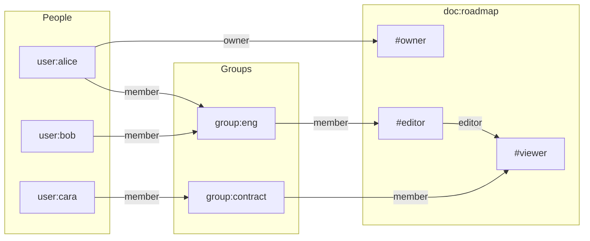
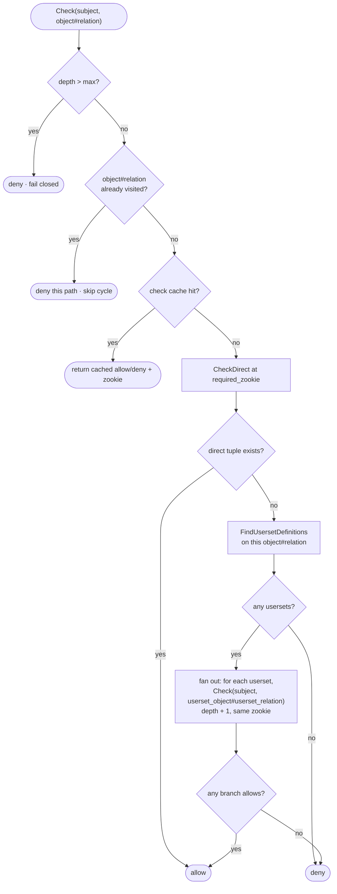
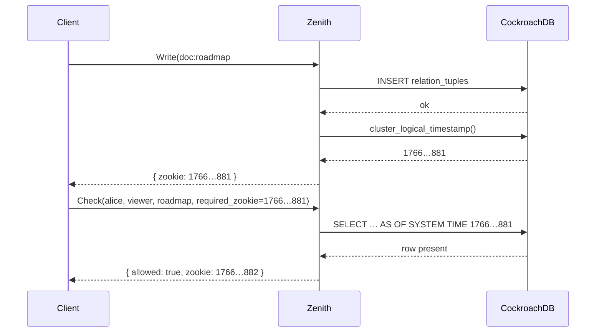
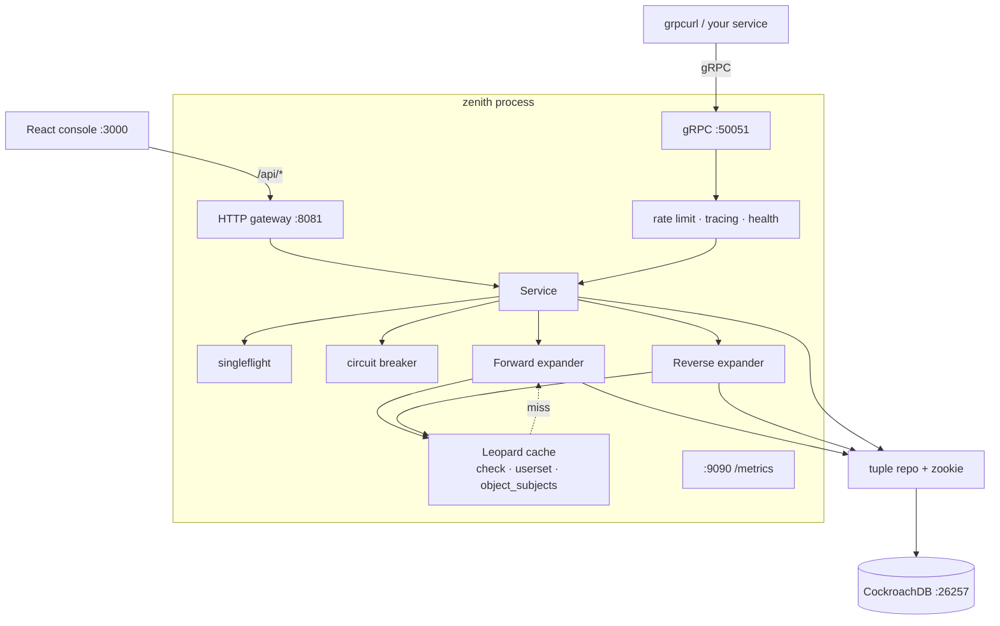

```
███████╗███████╗███╗   ██╗██╗████████╗██╗  ██╗
╚══███╔╝██╔════╝████╗  ██║██║╚══██╔══╝██║  ██║
  ███╔╝ █████╗  ██╔██╗ ██║██║   ██║   ███████║
 ███╔╝  ██╔══╝  ██║╚██╗██║██║   ██║   ██╔══██║
███████╗███████╗██║ ╚████║██║   ██║   ██║  ██║
╚══════╝╚══════╝╚═╝  ╚═══╝╚═╝   ╚═╝   ╚═╝  ╚═╝
```

<p align="center">
  <strong>A relation-based authorization engine.</strong><br/>
  One question. A graph of facts. A logical clock that never lies.
</p>

<p align="center">
  
  
  
  
  
</p>

---

Zenith answers a single question, at any depth of nesting, with a causal timestamp attached:

```
Does subject S have relation R on object O?
```

Not "is Alice in the `editors` role?" Not "does this JWT contain `doc:write`?" Those questions collapse the moment a group contains a group, a folder inherits from a parent, or a share is revoked while a replica is still catching up.

Zenith stores permissions as **relation tuples** — edges in a directed graph — and *walks* that graph until it finds a path, or proves there isn't one. Every write returns a **zookie**: an opaque logical timestamp from CockroachDB's hybrid logical clock. Hand it back on the next check, and the engine guarantees you see that write. Not eventually. Not maybe. At that point in the cluster's history.

If you have five minutes, read [The language](#the-language). If you have twenty, read [What Check actually does](#what-check-actually-does). If you want to run it, jump to [Bring it up](#bring-it-up).

---

## Contents

- [The problem this is for](#the-problem-this-is-for)
- [The language](#the-language)
- [A graph you can hold in your head](#a-graph-you-can-hold-in-your-head)
- [What Check actually does](#what-check-actually-does)
- [The other direction: who has access?](#the-other-direction-who-has-access)
- [Zookies, or how time is made comparable](#zookies-or-how-time-is-made-comparable)
- [How the machine is wired](#how-the-machine-is-wired)
- [The cache that refuses to be stupid](#the-cache-that-refuses-to-be-stupid)
- [Surfaces](#surfaces)
- [Bring it up](#bring-it-up)
- [Configuration](#configuration)
- [Measured](#measured)
- [Observability](#observability)
- [Map of the repo](#map-of-the-repo)
- [Further reading](#further-reading)

---

## The problem this is for

Role-based access control is a lookup table. Relation-based access control is a **search**.

In RBAC, Alice is an `editor`, documents have an `editors` list, and you join the two. The moment "editors of this doc" means "members of the eng group, plus anyone in a nested subgroup, plus anyone who can `view` the parent folder," the table stops being a table. It becomes a graph, and the only honest API is graph traversal.

That is the Zanzibar insight, and it is Zenith's entire job:

| Model | You store | A check is |
| --- | --- | --- |
| ACLs | per-object subject lists | a scan |
| RBAC | users ↔ roles ↔ permissions | a join |
| ReBAC (Zenith) | `(object, relation, subject)` tuples, where a subject can itself be `object#relation` | a walk |

The walk is bounded (max depth, timeout), concurrent (userset branches fan out), cycle-safe (visited-set), and consistent (every hop reads at the same logical time). Fail-closed: hitting max depth is a silent **deny**; hitting the timeout is `DEADLINE_EXCEEDED`. Neither is an allow.

---

## The language

Every permission in Zenith is one sentence, written as a tuple:

```
namespace:object_id # relation @ subject_namespace:subject_id [# subject_relation]
```

Two shapes. That is the whole grammar.

**Direct subject** — a specific user (or service, or bot) has a relation on an object:

```
doc:roadmap # viewer @ user:alice
```

> Alice can view the roadmap.

**Userset subject** — *whoever has relation R on object X* has this relation too:

```
doc:roadmap # viewer @ group:eng # member
```

> Anyone who is a member of `group:eng` can view the roadmap.

The second form is the entire source of power. A userset is not a copy of a membership list. It is a **pointer into the graph**. When membership changes, every document that pointed at the group changes with it. No fan-out write. No stale copies. The next Check walks the live edges.

Subjects and objects share the same namespace vocabulary. A group is just another object. A folder is just another object. That is how nesting falls out of the model instead of being a special case:

```
group:eng     # member @ user:bob
group:staff   # member @ group:eng    # member
folder:design # viewer @ group:staff  # member
doc:roadmap   # viewer @ folder:design # viewer
```

Bob is a member of eng, eng is a member of staff, staff can view the design folder, the roadmap inherits viewers from that folder. Four facts. One check. Arbitrary depth.

---

## A graph you can hold in your head

Monday. A company, three people, one document. These tuples are written:

```
group:eng      # member @ user:alice
group:eng      # member @ user:bob
group:contract # member @ user:cara
doc:roadmap    # owner  @ user:alice
doc:roadmap    # editor @ group:eng      # member
doc:roadmap    # viewer @ group:contract # member
doc:roadmap    # viewer @ doc:roadmap    # editor
```

The last line is the quiet one. It says: **every editor is also a viewer**. Relations compose. You do not copy Alice and Bob onto a second list. You point `viewer` at `editor`.



Now ask the engine three questions:

| Check | Walk | Result |
| --- | --- | --- |
| `alice` / `owner` / `roadmap` | direct edge | **allow** |
| `bob` / `viewer` / `roadmap` | `viewer` ← `editor` ← `group:eng#member` ← `bob` | **allow** |
| `cara` / `editor` / `roadmap` | `editor` has no path to cara | **deny** |

Cara can view. She cannot edit. Bob never had a `viewer` tuple written for him. He inherited it. Revoke Bob from `group:eng` and he loses both editor and viewer on every object that pointed at that group — because those objects never stored Bob at all.

That is the system. Everything else is making this walk fast, consistent, and operable.

---

## What Check actually does

`Check` is not a SQL `EXISTS`. It is a bounded OR-search over the permission DAG.



Four properties matter more than the diagram:

**1. Direct first, then expand.**
Most checks in a healthy system are direct. The engine asks CockroachDB for the exact tuple before it considers usersets. Fast path stays fast.

**2. Userset expansion is OR, and it is concurrent.**
Each userset definition is a goroutine. The first `allow` wins; remaining work is abandoned. Permission is existential: *any* path is enough. The zookie returned is the **max** zookie observed across the paths that ran, so the caller still holds a timestamp that covers the search.

**3. Cycles are skipped, not crashed.**
`group:a#member @ group:b#member` plus the reverse edge is a loop. The visited set keys on `namespace:object_id#relation`. A repeated node is treated as a dead path (`deny` this branch), not as an error. The rest of the graph still evaluates.

**4. Time and depth are budgets, not suggestions.**
Default max depth is 10. Default check timeout is 10ms (reverse expansion gets 100ms — it has more work to do). Past max depth, that branch is deny. Past timeout, the RPC errors. Authorization systems that fail open are how incidents become breaches.

```
L_check  ≈  L_network + L_cache  +  Σ  (L_db × P_miss_i)
                                         i = 1..depth
```

Cache hits drive `P_miss` toward zero and the sum disappears. That is why the cache is not an optimization bolted on later — it is part of the latency model. See [The cache that refuses to be stupid](#the-cache-that-refuses-to-be-stupid).

---

## The other direction: who has access?

`Check` walks **forward**: from a subject, toward an object, asking *is there a path?*

`ListSubjects` walks **backward**: from an object#relation, collecting every subject that can reach it. Same graph, inverted question. This is how you render a share dialog, an audit "who can see this?", or a graph node expansion in the console.

Reverse expansion is harder. Forward check can stop at the first allow. Reverse must enumerate. It has its own engine (`internal/engine/reverse_expander.go`), a longer timeout, a covering index so the lookup is an index-only scan:

```sql
-- migration 003
CREATE INDEX idx_reverse_expansion_covering
  ON relation_tuples (namespace, object_id, relation, subject_namespace, subject_id)
  INCLUDE (subject_relation);
```

and a dedicated cache (`object_subjects:{object}#{relation}`) so "who can view doc:roadmap?" does not re-walk the group tree on every paint of the UI.

`BatchCheck` is the practical cousin: up to 30 checks in one call, evaluated in parallel, one zookie (the max) for the whole batch. The console uses it. Your API gateway should too — one round trip for "can this user see these 12 files?"

---

## Zookies, or how time is made comparable

A **zookie** is not a wall clock. It is CockroachDB's hybrid logical clock, retrieved after a write:

```sql
SELECT cluster_logical_timestamp()::STRING;
-- "1766433684599320881.0000000000"
```

parsed to `int64`, returned on every `Write` / `Check` / `ListSubjects` / `BatchCheck`. Clients treat it as an opaque token. They do not interpret it. They **hand it back**.

```
Write(tuple)  ──────────────────────────►  zookie Z1
                                              │
Check(..., required_zookie = Z1)              │
  SELECT ... AS OF SYSTEM TIME Z1   ◄─────────┘
  → every write with timestamp ≤ Z1 is visible
```

This is causal consistency, not serializability:

- If write W returned Z, a later read with `required_zookie = Z` **will see W**.
- If you omit `required_zookie`, you get the current snapshot — faster, possibly stale relative to a write you just issued on another replica.
- The engine never reads *the future*. Effective timestamp is `max(required_zookie, now)` so a bogus or skewed token cannot time-travel past live data.
- Zookies expire with CockroachDB's MVCC GC window (`gc.ttlseconds`, default 25 hours). Do not store them as long-lived secrets. Use them as "I just wrote this, show it to me" tokens.



Without this, a UI that writes a share and immediately re-checks it will flicker deny. With it, the share is real the moment the write RPC returns.

The full proof, HLC walkthrough, and GC constraints live in [docs/ARCHITECTURE.md](docs/ARCHITECTURE.md). That document is the deep cut. This section is the contract.

---

## How the machine is wired



Three listeners, one process:

| Port | Surface | For |
| --- | --- | --- |
| `50051` | gRPC `zenith.v1.Zenith` | services, `grpcurl`, low-latency clients |
| `8081` | REST gateway | the console, curl, anything that speaks JSON |
| `9090` | Prometheus | `/metrics` |
| `26257` / `8080` | CockroachDB | SQL + admin UI *(not Zenith)* |
| `3000` | Vite + React | graph, checker, tuples, dashboard, audit |

Request path inside the process:

1. **Gateway or gRPC** deserializes, validates, maps errors to status codes.
2. **Service** (`internal/service`) applies singleflight so identical in-flight Checks collapse to one expansion, then optionally a circuit breaker so a sick database fails fast instead of queueing the world.
3. **Engine** walks. Forward for Check, reverse for ListSubjects. Both honor `required_zookie`.
4. **Cache** answers if it can. On write, **selective invalidation** drops only keys indexed under the touched object/subject patterns — not the entire LRU.
5. **Repo** talks to CockroachDB: exact-match check, userset discovery, covering-index reverse lookup, `AS OF SYSTEM TIME`, history table for audit.

Around that: OpenTelemetry spans on every expansion level (`RecursiveExpand`, `RecursiveExpand.Level`), Prometheus histograms for latency and depth, token-bucket rate limits, SLO trackers for p99 check latency, cache hit rate, error rate, availability.

It is deliberately **almost stateless**. The cache is local. Horizontal scale is "run more processes behind a gRPC-aware balancer." Shared cache / distributed singleflight via Redis exists as a package (`internal/dedup`) for when one node's LRU is no longer the truth.

---

## The cache that refuses to be stupid

Authorization caches are famous for two failure modes: serving a revoke, and flushing everything because one tuple changed.

Zenith's cache is named **Leopard** in the code, and it is built to avoid both.

**Three namespaces, not one.**

| Store | Key | Holds |
| --- | --- | --- |
| check | `check:{subject}:{object}#{relation}` | the answer you asked for |
| userset | `userset:{subject}:{object}#{relation}` | a sub-graph result, so nested checks reuse work |
| object_subjects | `object_subjects:{object}#{relation}` | reverse-expansion membership |

**Negative caching, shorter-lived.**
A deny is cached too — otherwise "does this random user have access?" becomes a full expansion every time. Positive TTL defaults to 30s. Negative TTL defaults to 5s. Denies go stale faster than allows, which is the correct bias: you would rather re-check a deny than serve a revoke late. The engine caches the **finished** Check (after userset expansion), never the intermediate direct miss. Caching the miss first would turn every nested allow into a cached deny.

**Soft / hard expiration.**
Soft-expired entries are served stale while a background worker refreshes them. Hard-expired entries are dead. The check path does not wait on a thundering herd of refreshes.

**Selective invalidation.**
Each cached key is indexed under the object pattern and subject pattern it depends on. A write to `doc:roadmap#viewer@…` does not purge `folder:design`. It purges the keys that could have been affected. That is the difference between a cache and a very fast source of bugs.

**Singleflight in front of the engine.**
Ten identical Checks arriving in the same millisecond become one expansion. The other nine wait and share the result. Combined with the cache, this is why a hot object does not become a hot database.

---

## Surfaces

### gRPC — `zenith.v1.Zenith`

| RPC | Question |
| --- | --- |
| `Write` | insert or delete one tuple; returns a zookie |
| `Check` | does this subject have this relation on this object? |
| `ListSubjects` | who has this relation on this object? |
| `BatchCheck` | the same, up to 30 times, one round trip |

```protobuf
rpc Write(WriteRequest) returns (WriteResponse);
rpc Check(CheckRequest) returns (CheckResponse);
rpc ListSubjects(ListSubjectsRequest) returns (ListSubjectsResponse);
rpc BatchCheck(BatchCheckRequest) returns (BatchCheckResponse);
```

Full field reference: [docs/API.md](docs/API.md). Proto source: [`internal/api/zenith.proto`](internal/api/zenith.proto).

### HTTP — `:8081`

| Method | Path | Maps to |
| --- | --- | --- |
| `GET` | `/api/health` | liveness |
| `GET` | `/api/tuples` | list all tuples *(console / graph)* |
| `POST` | `/api/tuples` | `Write` (`operation`: `"insert"` \| `"delete"`) |
| `POST` | `/api/check` | `Check` |
| `POST` | `/api/batch-check` | `BatchCheck` |
| `GET` | `/api/subjects/{ns}/{object}/{relation}` | `ListSubjects` |

CORS, logging, and panic recovery sit on this mux. The Vite app proxies `/api` here.

### Console — `:3000`

A React app for people who think in graphs:

| Route | What you see |
| --- | --- |
| `/` | permission graph — nodes, edges, the DAG as a picture |
| `/check` | interactive Check, expansion path |
| `/batch` | BatchCheck table |
| `/tuples` | write / delete / inspect tuples |
| `/dashboard` | latency, cache, expansion-depth charts |
| `/audit` | point-in-time view over tuple history |

This is not a demo skin. It is the same gateway your services should call, with visx + recharts on top of live data.

---

## Bring it up

**Need:** Go 1.21+, Node 18+, Docker, `protoc` (only if you regenerate stubs).

```bash
git clone https://github.com/yxshwanth/zenith.git
cd zenith

# 1. database
docker compose up -d
docker exec zenith-cockroachdb ./cockroach sql --insecure \
  -e 'CREATE DATABASE IF NOT EXISTS zenith;'

# 2. config
cp config.example.yaml config.yaml

# 3. engine
go build -o zenith ./cmd/server
./zenith -config=config.yaml
```

You should see the process claim its three ports:

```
Database connection established
Migrations completed
Cache initialized: size=10000, ttl-positive=30s, ttl-negative=5s
Expansion engine initialized: max-depth=10, timeout=10ms
Starting metrics server on port 9090...
Starting HTTP gateway on port 8081...
Starting gRPC server on port 50051...
```

Console, in another terminal:

```bash
cd frontend && npm install && npm run dev
# http://localhost:3000
```

Prove the engine with one write and one check:

```bash
grpcurl -plaintext -d '{
  "tuple": {
    "namespace": "doc",
    "object_id": "roadmap",
    "relation": "viewer",
    "subject_namespace": "user",
    "subject_id": "alice"
  },
  "operation": "WRITE_OPERATION_INSERT"
}' localhost:50051 zenith.v1.Zenith/Write
```

```bash
grpcurl -plaintext -d '{
  "subject_namespace": "user",
  "subject_id": "alice",
  "namespace": "doc",
  "object_id": "roadmap",
  "relation": "viewer"
}' localhost:50051 zenith.v1.Zenith/Check
```

```json
{ "allowed": true, "zookie": "1766…" }
```

Same round trip over HTTP:

```bash
curl -s http://localhost:8081/api/check \
  -H 'Content-Type: application/json' \
  -d '{
    "subject_namespace": "user",
    "subject_id": "alice",
    "namespace": "doc",
    "object_id": "roadmap",
    "relation": "viewer"
  }'
```

Nested userset (the example from [the graph](#a-graph-you-can-hold-in-your-head)): write `group:eng#member@user:bob`, write `doc:roadmap#viewer@group:eng#member`, then Check bob. The engine expands. Bob was never granted `viewer` directly.

Step-by-step with troubleshooting: [RUN_GUIDE.md](RUN_GUIDE.md).

---

## Configuration

Priority, highest first: **flags → environment (`ZENITH_*`) → file → defaults**.

```yaml
server:
  port: 50051
  metrics_port: 9090
  http_port: 8081          # 8080 belongs to CockroachDB's admin UI
  reflection: true

database:
  connection_string: "postgres://root@localhost:26257/zenith?sslmode=disable"
  max_open_conns: 25
  max_idle_conns: 5
  conn_max_lifetime: 5m
  health_check_interval: 30s

cache:
  enabled: true
  size: 10000
  ttl_positive: 30s
  ttl_negative: 5s

engine:
  max_depth: 10
  check_timeout_ms: 10     # fail closed

tracing:
  enabled: true
  endpoint: "localhost:4317"

rate_limit:
  enabled: false
  global_rps: 1000
  per_client_rps: 100
  burst_size: 10
```

```bash
./zenith -config=config.yaml -port=50051 -enable-cache=true
export ZENITH_DATABASE_CONNECTION_STRING="postgres://..."
```

Examples: [`config.example.yaml`](config.example.yaml), [`config.example.json`](config.example.json).

---

## Measured

These numbers come from `go run ./cmd/bench` against a live CockroachDB and a live `./zenith`, not from in-memory mocks.

**Setup:** Apple M3, 16 GB, macOS, Go 1.25.5. CockroachDB single-node in Docker on loopback. 75,002 tuples (50k direct docs, 1k groups × 20 members, 5k group-granted docs). 20,000 Checks × 50 clients after 2,000 warmup. `check_timeout_ms=50`, tracing off.

### The extra round trip is gone

Every Check used to run `SELECT 1 … LIMIT 1` and then a second `SELECT cluster_logical_timestamp()`. Direct hits now fetch existence and the zookie in one statement.

| SQL path (same tuple, same pool, 3,000 iters) | p50 | p99 | QPS |
| --- | --- | --- | --- |
| Legacy: `SELECT 1` + `GetZookie` | 297 µs | 802 µs | 3,103 |
| Combined: `EXISTS` + zookie | **194 µs** | 1.00 ms | **4,159** |

p50 is **35% lower**. Throughput is **34% higher**. The gap is a round trip; it grows with database RTT. Loopback is the conservative case.

A single userset (the common nested shape) no longer spawns a goroutine to walk one child.

### gRPC Check

| Scenario | Cache | p50 | p99 | QPS | Result |
| --- | --- | --- | --- | --- | --- |
| Direct, hot key | on | **387 µs** | **0.99 ms** | **114,116** | 20,000 / 20,000 allow |
| Nested (doc → group → user), hot key | on | **434 µs** | **1.59 ms** | **97,050** | 20,000 / 20,000 allow |
| Deny, hot key (negative cache) | on | 374 µs | 1.13 ms | 117,222 | 0 / 20,000 allow |
| Direct, uniform over 50k docs | on | 2.89 ms | 11.5 ms | 15,770 | allow |
| Direct, hot key | off | 638 µs | 1.73 ms | 70,685 | 20,000 / 20,000 allow |
| Nested, hot key | off | 1.04 ms | 2.11 ms | 45,373 | 20,000 / 20,000 allow |
| Direct, uniform over 50k docs | off | 2.85 ms | 11.5 ms | 14,741 | allow |

Hot nested Checks are **2.4× faster p50** with the cache on than off, because the engine now stores the expansion result instead of the first-hop miss.

Reproduce:

```bash
docker compose up -d
docker exec zenith-cockroachdb ./cockroach sql --insecure \
  -e 'CREATE DATABASE IF NOT EXISTS zenith;'
go build -o zenith ./cmd/server
./zenith -config=config.yaml -check-timeout=50 -enable-tracing=false

# another terminal
go run ./cmd/bench -mode=seed
go run ./cmd/bench -mode=sql
go run ./cmd/bench -mode=load
```

Or `./scripts/bench.sh` once the server is up. Full notes: [docs/PERFORMANCE.md](docs/PERFORMANCE.md).

---

## Observability

Authorization that you cannot see is authorization you cannot trust.

**Prometheus** — `http://localhost:9090/metrics`

| Metric | Why it exists |
| --- | --- |
| `zenith_requests_total` | volume and error rate by operation |
| `zenith_request_duration_seconds` | the SLO histogram |
| `zenith_cache_hits_total` / `_misses_total` | whether the latency model is working |
| `zenith_expansion_depth` | your permission graph getting deeper than you think |
| `zenith_database_query_duration_seconds` | the term that dominates a cache miss |
| `zenith_batch_check_size` | how hard the console / gateway is pushing |
| `zenith_active_connections` | pool saturation |

A Grafana dashboard lives in [`scripts/dashboard.json`](scripts/dashboard.json). Tracing goes to any OTLP collector (`localhost:4317` by default); expansion depth, cache hit/miss, and zookie are span attributes, not log archaeology.

Latency and QPS are in [Measured](#measured), not guessed here.

---

## Map of the repo

```
zenith/
├── cmd/server/                 process: gRPC + gateway + metrics
├── cmd/bench/                  seed Cockroach + SQL/gRPC load numbers
├── internal/
│   ├── api/zenith.proto        the contract
│   ├── service/                validation, singleflight, BatchCheck
│   ├── engine/                 forward + reverse expansion, cycle detection
│   ├── cache/                  Leopard: three LRUs, selective invalidation
│   ├── db/                     repo, zookies, AS OF SYSTEM TIME, migrations
│   ├── gateway/                REST/JSON over the same service
│   ├── circuitbreaker/         fail fast when the database is not itself
│   ├── dedup/                  Redis-backed distributed singleflight
│   ├── slo/                    error budgets as code
│   ├── middleware/             token-bucket rate limit
│   ├── metrics/                Prometheus
│   ├── observability/          OpenTelemetry
│   ├── config/                 file + env + flags
│   ├── models/                 Tuple, the one type that matters
│   └── errors/                 gRPC status mapping
├── frontend/                   graph, checker, tuples, dashboard, audit
├── docs/                       architecture, API, deploy, performance
├── scripts/                    tests, profiling, Grafana
└── docker-compose.yml          CockroachDB, single-node, local
```

```bash
go test ./...
go test -cover ./...
go test -bench=. -benchmem ./internal/engine ./internal/cache ./internal/service
```

There are unit tests, expander fuzz tests, property tests, and a chaos test for the service. Integration against a live cluster: [TESTING.md](TESTING.md), `./scripts/test.sh`.

---

## Further reading

| Document | When to open it |
| --- | --- |
| [docs/ARCHITECTURE.md](docs/ARCHITECTURE.md) | HLC, MVCC, the zookie proof, time-travel prevention |
| [docs/API.md](docs/API.md) | every field, error code, and grpcurl example |
| [docs/PERFORMANCE.md](docs/PERFORMANCE.md) | latency model, cache sizing, load tests |
| [docs/DEPLOYMENT.md](docs/DEPLOYMENT.md) | Docker, Kubernetes, production checklist |
| [docs/DEVELOPMENT.md](docs/DEVELOPMENT.md) | conventions, how to change the engine |
| [RUN_GUIDE.md](RUN_GUIDE.md) | ports, CORS, "it won't start" |
| [TESTING.md](TESTING.md) | how we know a Check is a Check |
| [Zanzibar (Google, 2019)](https://research.google/pubs/zanzibar-googles-consistent-global-authorization-system/) | the paper this system is in conversation with |
| [Hybrid Logical Clocks](https://cse.buffalo.edu/tech-reports/2014-04.pdf) | why zookies can be compared across nodes |

---

Zenith is a graph, a clock, and a fail-closed walk between them.

Write facts. Check paths. Keep the zookie.
