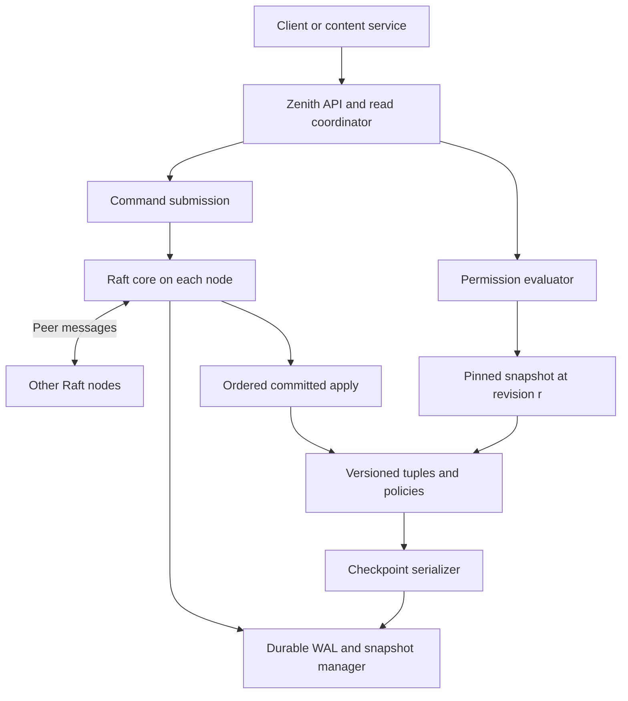
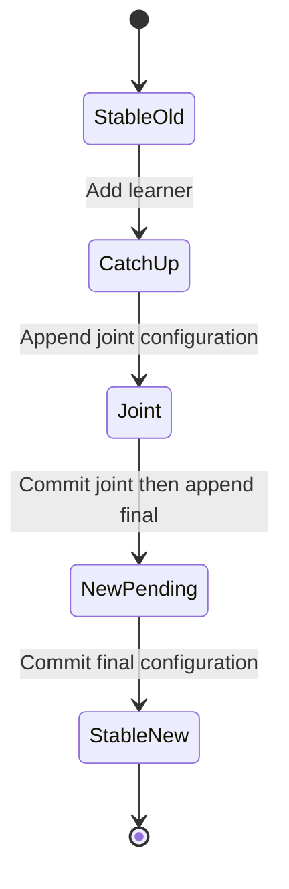
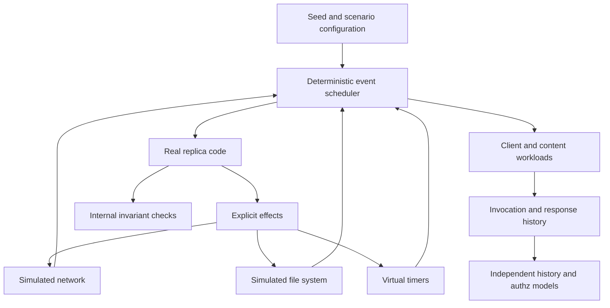

# Zenith v2: Replication and Correctness Roadmap

**Status:** Proposed design and implementation plan.
**Updated:** August 31, 2026.
**Repository:** yxshwanth/zenith.
**Source review baseline:** `a48609be4c0882f5e158fc73d014c177c2df7eec`, August 16, 2026.

This document defines the proposed transition from the CockroachDB-backed authorization engine to a replicated authorization database with a custom Raft implementation and deterministic failure testing. It covers architecture, consistency contracts, implementation scope, validation, migration, and completion criteria.

No v2 implementation, passing test campaign, benchmark result, or simulator discovery is claimed here. Baseline observations apply only to the pinned source revision. Package paths, APIs, commands, and milestones below are implementation targets unless explicitly identified as existing behavior. This is a design update, not a release changelog.

## Contents

1. [Overview](#1-overview)
2. [Baseline assessment and planned changes](#2-baseline-assessment-and-planned-changes)
3. [Scope and architecture decisions](#3-scope-and-architecture-decisions)
4. [System architecture](#4-system-architecture)
5. [Correctness and fault model](#5-correctness-and-fault-model)
6. [Raft implementation](#6-raft-implementation)
7. [Durable WAL, recovery, and snapshots](#7-durable-wal-recovery-and-snapshots)
8. [MVCC and logical revisions](#8-mvcc-and-logical-revisions)
9. [Zookies and read semantics](#9-zookies-and-read-semantics)
10. [Preventing the new-enemy problem](#10-preventing-the-new-enemy-problem)
11. [Authorization evaluator](#11-authorization-evaluator)
12. [API and client contract](#12-api-and-client-contract)
13. [Deterministic simulation harness](#13-deterministic-simulation-harness)
14. [Invariants and independent checkers](#14-invariants-and-independent-checkers)
15. [Required failure scenarios](#15-required-failure-scenarios)
16. [CI, replay, and bug evidence](#16-ci-replay-and-bug-evidence)
17. [Migration and repository strategy](#17-migration-and-repository-strategy)
18. [Milestones and completion gates](#18-milestones-and-completion-gates)
19. [Optional Leopard-inspired indexing](#19-optional-leopard-inspired-indexing)
20. [Demonstration, observability, and release evidence](#20-demonstration-observability-and-release-evidence)
21. [Core acceptance checklist](#21-core-acceptance-checklist)
22. [References and implementation reading order](#22-references-and-implementation-reading-order)

## 1. Overview

Zenith v2 is planned as a small replicated authorization database in Go. The repository will implement the Raft consensus core, durable log, recovery, versioned tuple storage, and deterministic simulator. The same consensus and storage code will run in a real multiprocess cluster and in a single-threaded simulator. Relationship-based permissions will be evaluated at one explicit committed revision. A content-version protocol will prevent stale permissions from authorizing causally newer content within the documented integration contract. Invariants, reproducible failure traces, and confirmed bugs will be maintained alongside the code.

This is an experimental systems project with a deliberately narrow consistency boundary. It is not a production replacement for OpenFGA, SpiceDB, CockroachDB, or Google's Zanzibar.

**Engineering objectives**

- Define and test the ordering between persistence, replication, commitment, application, and client acknowledgement.
- Specify separate contracts for linearizable operations, historical reads, and minimum-revision reads.
- Preserve permission semantics across recursive evaluation, caching, retries, restarts, and replica lag.
- Validate externally observable results with an independent oracle.
- Reproduce failures using a build revision, seed, workload, and minimized event trace.
- Document the fault conditions under which availability or durability is no longer promised.

Correctness claims must be supported by reproducible evidence. Feature expansion and performance tuning follow the correctness gates in this plan.

## 2. Baseline assessment and planned changes

The baseline review was limited to source inspection at the pinned commit. It was not a security audit. The Go toolchain was unavailable in that review environment, so the repository's tests were not executed. The findings below require runnable reproductions before they can be classified as demonstrated runtime failures.

| Existing area | Observed behavior | Decision for v2 |
|---|---|---|
| Tuple model | Six fields represent object, relation, and direct subject or userset. | Preserve the vocabulary and examples; add a store boundary. |
| Forward evaluator | Direct lookup followed by userset OR expansion; multiple branches use goroutines. | Reuse semantic examples, rewrite traversal around an immutable snapshot handle and explicit work scheduling. |
| Reverse evaluator | ListSubjects traverses usersets and caches expansions. | Port after Check; require one revision and explicit completeness semantics. |
| Repository abstraction | The evaluator has TupleRepository, but Service stores a concrete `*db.TupleRepo` and engine constructors import `db`. | Separate command submission, read coordination, snapshot reads, and evaluation. |
| API tokens | `zenith.v1` uses int64 zookie and `required_zookie`. | Introduce `zenith.v2` and opaque tokens; do not reinterpret old integers. |
| Timestamp parsing | `ParseZookieString` scans a Cockroach decimal timestamp into an integer, discarding its fractional component. | Remove this encoding entirely from the new path. |
| Write token | `ExecWithZookie` executes the mutation and fetches a timestamp in a subsequent call. | Return the revision of the committed command and its deterministic result. |
| Snapshot selection | `CheckDirect` uses the requested timestamp; `QueryWithZookie` independently obtains a current timestamp and chooses a maximum. Untokened recursive reads are not pinned together. | Select one revision before evaluation; all tuple and policy reads use it exactly. |
| Cache freshness | The forward evaluator returns a cache hit without comparing it to `RequiredZookie`. Cache keys omit the evaluation revision. | Disable decision caching initially; later key by the exact selected revision. |
| Failure fallback | `checkStale` contains a cached-result return without requested-zookie validation; its lookup key also differs from the normal cache key. | Remove this fallback; return an explicit error when the contract cannot be satisfied. |
| Error meaning | Some timeouts and batch item errors become ordinary denied results. | Separate a proven DENY from an incomplete evaluation. Both block content access. |
| Cycle handling | A shared visited set is used across branches. | Separate path-local cycle detection from completed-result memoization; test depth-sensitive shared subgraphs. |
| "Chaos" tests | Several tests exercise local helpers; `TestConcurrentWriteReadRace` consists of sleep loops. | Keep useful local tests, replace the advertised distributed coverage with real simulated node and disk failures. |
| Property tests | `TestZookieMonotonicity` checks a literal increasing slice. | Check system-generated histories and committed revisions instead. |
| Deployment | Compose starts one CockroachDB node. | Add three Zenith processes, separate data directories, explicit peer identities, and restart scenarios. |

Source map: [Z1](#z1), [Z2](#z2), [Z3](#z3), [Z4](#z4), [Z5](#z5), [Z6](#z6), [Z7](#z7).

The fallback uses a colon-separated lookup key, whereas the normal cache key uses a hash before the relation. Its cache accessor also enforces hard expiry despite the fallback comment suggesting otherwise. These findings establish inconsistent wiring and an intended fallback that lacks the required freshness validation; they do not establish a reproduced disclosure through that path. The ordinary evaluator cache-hit path independently lacks requested-revision validation.

Snapshot selection must be an explicit contract. Passing a caller-supplied integer through repository methods does not ensure that all reads use one revision. Returning the maximum revision encountered across independent reads cannot establish a coherent snapshot retroactively.

**Preserve, replace, defer**

Preserve the tuple concepts, useful graph fixtures, gRPC surface as a design reference, CLI examples, and selected observability plumbing. The React graph view can become a later demo surface.

Replace the Cockroach storage path, timestamp handling, decision-cache policy, concrete service dependency, evaluator scheduling, and test harness.

Defer distributed singleflight, Redis, stale-while-revalidate authorization decisions, cache hierarchies, broad UI work, Kubernetes packaging, and performance tuning. They would add failure paths before the underlying contract is stable.

Adversarial graph tests must cover recursion, shared subgraphs, interrupted evaluation, and streaming completeness. These are required test areas, not confirmed defects in the baseline.

## 3. Scope and architecture decisions

| Decision | Initial choice | Reason and consequence |
|---|---|---|
| Language | Go, with a pinned supported toolchain | Matches the existing repository and allows Porcupine integration. |
| Consensus ownership | Custom Raft implementation | Consensus code is the subject of the project. Existing implementations are references, not the runtime dependency. |
| Replication boundary | One Raft group for the entire cluster | Every tuple and policy dependency has one ordering domain. No cross-group transactions. |
| Cluster size | Three voters; five in selected simulations | Three tolerates one unavailable voter while a healthy majority remains. Five broadens quorum scenarios. |
| Timestamp | Committed Raft log index, scoped by cluster epoch and group | A logical revision, not wall-clock time. No HLC or TrueTime imitation is necessary. |
| State storage | In-memory ordered MVCC structures, rebuilt from a custom WAL and snapshots | Keep recovery and version semantics in the repository without implementing a full LSM tree. The dataset must fit memory. |
| Baseline strong reads | Commit a read-fence entry, then read exactly that revision | Simple, inspectable ordering; deliberately adds log traffic. |
| Optimized strong reads | Quorum-confirmed ReadIndex, added later | Requires additional term, request-context, application, and configuration checks. |
| Read leases | Excluded | Avoid introducing clock-bound assumptions into read safety. |
| Evaluation | Local to one replica at one immutable snapshot | No remote graph subqueries in the first version. |
| Simulation | Same core, different clock/network/disk adapters | Failures exercise implementation code rather than a second consensus model. |
| Production network | gRPC peer messages and client API | Serialization and backpressure remain adapter responsibilities. |
| First query language | Existing direct tuples and userset union | Intersection, exclusion, and policy rewrites are staged additions. |
| Membership | Required for the complete project, after the fixed cluster | Joint consensus, learners, durable configuration recovery. |
| Leopard | Optional after the complete core | Introduces a separate index-correctness problem and depends on the core correctness gates. |

Sharding is outside the initial scope. One Raft group provides a single ordering domain for replication, elections, durability, and partial-failure recovery. It does not provide independent write scaling across shards or transactions across multiple groups.

**Explicit non-goals**

No Byzantine fault tolerance, geo-global external consistency, multi-group revision comparison, automatic recovery after destruction of all durable copies, arbitrary SQL, distributed transactions with the content store, transparent rolling upgrades, or production security certification.

Clock skew may harm liveness or deadlines, but must not change what a committed revision means. Logical revision distance does not establish a bound in seconds on data staleness.

## 4. System architecture



Each node has the same components. A follower forwards writes or returns a leader hint. It may serve reads only under the requested read contract. No node may decide that being reachable makes its state current.

The API coordinator obtains the selected revision. The evaluator receives a snapshot already opened at that revision. The evaluator does not elect leaders, issue independent "get current time" calls, or decide whether a replica is fresh enough.

**Package boundaries**

| Proposed path | Responsibility |
|---|---|
| `cmd/zenithd` | Real node process and adapter wiring |
| `cmd/zenithctl` | Bootstrap, inspect, write, check, membership operations |
| `cmd/zenith-sim` | Seeded scenarios, replay, shrinking, reports |
| `api/zenith/v2` | Versioned client protobuf definitions |
| `internal/raft` | Pure consensus transitions and quorum/configuration logic |
| `internal/replica` | Coordinates persistence completions, committed apply, reads, replies |
| `internal/wal` | Record format, checksums, append, sync, truncation, recovery |
| `internal/snapshot` | Checkpoint format, atomic publication, transfer and install |
| `internal/mvcc` | Version chains, tombstones, ordered indexes, snapshot retention |
| `internal/authz` | Snapshot-based tuple evaluation and graph semantics |
| `internal/token` | Opaque scoped revision encoding and validation |
| `internal/session` | Replicated request deduplication and session fences |
| `internal/runtime` | Event/effect interfaces used by real and simulated adapters |
| `internal/transport` | Peer and client network adapters |
| `internal/sim` | Scheduler, virtual clock, network and storage models |
| `internal/checker` | Independent sequential models, history adapter, invariants |
| `examples/content-service` | Minimal immutable content-version integration |
| `docs/adr` | Architecture decisions and rejected alternatives |
| `docs/invariants.md` | Numbered contracts and their checkers |
| `docs/bugs` | Actual simulator discoveries and fixes |
| `testdata/regressions` | Minimized traces, seeds, workload/configuration fixtures |

The paths in this table are proposed. Their inclusion does not indicate that the packages or documents exist yet.

**Deterministic core contract**

Use explicit event transitions. The conceptual Go interface is:

```go
type Core interface {
    Step(Event) []Effect
}
```

Events include a peer message, client command, election tick, disk completion, snapshot chunk, cancellation, and scheduled evaluation work. Effects include persist, sync, send, schedule, apply, and reply. Give asynchronous requests stable IDs and explicit dependencies.

The adapter cannot send a vote response that depends on durable state until the corresponding sync completion has been fed back into the core. A "Ready" batch is not permission to perform every listed effect in arbitrary order.

The initial implementation will allow one ordered persistence batch in flight per node, with bounded buffering for unrelated inputs. Disk/network overlap is deferred until failure tests cover this ordering.

The etcd Raft project is an architectural reference for separating deterministic transitions from I/O [T3](#t3). Zenith will implement its own consensus transitions.

## 5. Correctness and fault model

**Target correctness contracts**

1. A successful mutation has a deterministic result, is durably replicated to a valid quorum, and has been applied before its success response is released.
2. The same logical request cannot apply its effect twice within the documented session contract.
3. Strong reads behave as operations on one linearizable state machine.
4. Exact reads evaluate the state at their specified retained revision.
5. Minimum-revision reads evaluate a single committed revision at least as large as the supplied token.
6. An incomplete permission computation never authorizes content.
7. An acknowledged revocation cannot be omitted from the snapshot protecting a causally subsequent content version when the integration protocol is followed.
8. After faults stop and a viable quorum can communicate with adequate resources, progress resumes.

These are acceptance targets. They become supported guarantees only when the corresponding implementation and validation evidence are available.

**Supported faults and assumptions**

Support delayed, dropped, duplicated, reordered, and asymmetrically partitioned messages; process crashes and restarts; pauses; delayed disk I/O; failed writes and syncs; crash-torn unsynced writes; and wall-clock jumps.

Peers are assumed to be non-malicious. A successful fsync honors the modeled persistence contract. Unsynced data may disappear, survive in full, or partially persist. The simulator must exercise each permitted outcome because surviving unsynced writes can also expose recovery bugs.

Latent corruption is a separate extension. A node must detect checksum failures and stop serving from uncertain state. Ordinary Raft does not repair arbitrary durable corruption. Loss of enough durable copies can make data unrecoverable. Recovery must not silently bootstrap a fresh cluster with the old identity.

The simulator's file-system model is an abstraction. State its allowed write, rename, sync, and crash behaviors precisely. Real integration tests are still needed for the adapter and actual file system.

## 6. Raft implementation

**Core state and transitions**

Maintain current term, voted-for identity, log entries, role, commit index, applied index, peer replication progress, and the effective membership configuration. Persist term, vote, and log changes before releasing dependent responses.

Use the standard Raft election, log-matching, current-term commitment, and snapshot rules as the normative baseline [T1](#t1). A higher term is not a data revision. An uncommitted log index is not an externally valid zookie.

Represent a log record with version, index, term, command type, payload length, payload, and checksum. Encode payloads canonically. Administrative commands and read fences consume indices too; logical revisions may therefore have gaps between tuple changes.

API responses must distinguish four states of a log entry: present in memory, present on disk, known committed, and applied.

**Mutations and client retries**

For a new request:

1. Authenticate and validate structural input at the API boundary.
2. Forward to the leader or return a retryable leader hint.
3. Append a command containing store, session, request sequence, payload digest, and operation.
4. Persist locally and replicate; require durable acknowledgements from the applicable quorum.
5. Advance commitment using the selected Raft protocol.
6. Apply committed commands in order, evaluating state-dependent preconditions at apply time.
7. Record the deterministic response and return its revision.

A mutation batch is one atomic state-machine command with explicit byte and operation-count limits. The initial implementation must reject conflicting changes to the same tuple within one batch.

A timeout after submission means outcome unknown, not "did not commit." Retry the same request identity and identical payload. A reused identity with a different digest is an error.

For the first version, allow one outstanding mutation per client session and retain the latest sequence, digest, result, and revision in replicated state. An older sequence is rejected, not executed again. Keep sessions for the experiment's lifetime initially; later add explicit replicated session retirement and a clearly defined retry window. Snapshot session state with the application.

This is at-most-once application inside an explicit contract, not a universal exactly-once network guarantee.

**Pre-vote and leader health**

Add pre-vote after basic elections work. A node tests whether an election is plausible before increasing its real term. Pre-vote messages require their own handling: a prospective term must not blindly flow through the ordinary higher-term persistence path.

Cover an isolated former follower reconnecting, delayed pre-vote responses, stale log candidates, repeated split votes, and membership changes during an election. Follow one published specification and its errata [T2](#t2).

Use logical election ticks supplied by the runtime. Check-quorum can help an isolated leader step down, but does not replace a valid read protocol.

**Membership changes**

Use joint consensus, based on the extended Raft paper's Section 6 [T1](#t1). Do not combine the paper's configuration activation rules with a library's different apply-time scheme.

The intended administrative sequence is:



Specify the exact algorithm in an ADR before enabling the feature:

- Only one voter-set transition is in flight.
- A learner receives snapshots and log entries but does not count toward a voter quorum.
- Catch-up is an admission policy; it does not replace the joint quorum rule.
- While joint configuration is effective, elections and commitment require a majority of both voter sets, not a majority of their union.
- Under the selected paper algorithm, the newest configuration in a node's log governs it when appended; overwriting an uncommitted configuration must restore the effective predecessor.
- Append the final new configuration only after the joint configuration commits. Apply the paper's new-configuration commitment rules, including removal of the current leader.
- Include configuration information at the checkpoint boundary; reconstruct later configuration entries from the retained suffix.
- Never reuse a removed node ID. Reject obsolete administrative and peer identities.
- A removed leader finishes only what the protocol permits and stops client leadership after final removal.

During membership work, keep strong reads on the logged-fence path. Add optimized ReadIndex across configuration transitions only after the fixed-configuration version is solid.

Required membership experiments include leader removal, a learner crashing during snapshot install, restart during the joint phase, and the old set being able to communicate while the new set lacks a majority.

## 7. Durable WAL, recovery, and snapshots

**WAL model**

Use checksummed framed records and explicit sync barriers. A checksum detects damage; it does not prove an entry committed.

Track submitted writes, completed writes, and completed syncs separately. A follower must not emit a durable append acknowledgement merely because bytes reached an in-memory buffer. Initially persist the leader's own entries before replication to reduce ordering complexity.

A torn suffix may be discarded only where the storage contract and record structure establish an incomplete uncommitted tail. A checksum failure in the middle of required durable history is corruption: stop and require controlled recovery.

WAL suffix replacement must itself be crash-safe. Do not truncate a valid prefix before the replacement metadata is safely established. Model truncation and segment changes explicitly.

**Recovery procedure**

1. Validate the data directory's cluster epoch and node identity.
2. Select a complete, checksummed, durably published snapshot.
3. Restore its application state, retained MVCC history, session table, and configuration.
4. Scan the retained WAL suffix; preserve valid entries and term/vote state.
5. Reconstruct Raft state without assuming every durable suffix entry committed.
6. Obtain commitment through the protocol before exposing unapplied suffix effects.
7. Enable serving only after the requested read or write contract can be met.

With an in-memory state machine, applied progress beyond the durable checkpoint may need replay after restart. It must not be mistaken for permanent data loss or for permission to serve stale "latest" reads. Compare applied counters monotonically within one process incarnation, and compare durable acknowledged effects across incarnations.

**Snapshot creation and publication**

A snapshot describes a committed, applied prefix at index `s` and includes:

- Last included index and term.
- Cluster epoch, group identity, format version, checksums.
- Effective configuration at that boundary.
- All MVCC versions needed by the retained history floor.
- Policy definitions and tuple indexes, or enough canonical data to rebuild them.
- Client session/deduplication state.
- Retention metadata and any required derived-index checkpoint metadata.

Capture an immutable checkpoint view; later applied writes must not leak into a snapshot labeled `s`.

Publish a new generation crash-safely: write a temporary snapshot, sync its data, publish its manifest through an atomic rename protocol, sync the directory as required by the supported platform, and only then retire covered WAL segments. Test each boundary rather than treating rename alone as durable publication.

On install, stage and validate all chunks before activation. Key transfers by sender/term, snapshot ID, and offsets. Ignore obsolete or regressive snapshots. Preserve a matching log suffix only when its boundary agrees with the snapshot's index and term; otherwise use the protocol's replacement rule.

Snapshots must not overwrite a newer applied state. Crash after activation but before cleanup must still recover one coherent generation.

**Two separate kinds of compaction**

Raft compaction removes log prefixes covered by durable snapshots.

MVCC garbage collection removes old application versions outside the supported history window.

A snapshot that retains only current tuple values would destroy historical reads even if Raft recovery remained correct. Keep the two contracts separate.

## 8. MVCC and logical revisions

**Data model**

Use a canonical tuple key:

```
(store, object_namespace, object_id, relation,
 subject_namespace, subject_id, subject_relation)
```

Do not construct keys by unescaped concatenation with punctuation that user IDs may contain. Use length-prefixed fields or another unambiguous encoding.

Each version has a committed revision and a present/deleted value. Policy versions live in the same ordering domain when a policy language is added.

For tuple `k` at revision `r`:

```
visible(k, r) = latest version of k whose revision <= r
```

A tombstone means absent. Reads are legal only at a locally materialized committed revision. Uncommitted log records cannot enter the visible index.

Apply a batch atomically at one revision. Every mutation in that batch becomes visible together. Evaluation never sees half the batch.

**Indexes and scans**

Start with ordered indexes supporting exact tuple lookup and scans by object/relation. Add reverse indexes when implementing ListSubjects. A generic ordered-container dependency is acceptable; consensus, durability, and MVCC visibility must remain implemented in this repository.

All indexes are updated in the same deterministic apply step. Sort external enumerations and canonical state hashes. Do not let randomized Go map iteration affect scheduling, snapshot byte order, or operation results.

Full tuple and policy state fits in memory for this version. Report that limit explicitly. An LSM engine is a separate project and is not required to demonstrate the target failure behavior.

**Snapshot interface**

```go
type Snapshot interface {
    Revision() Revision
    Contains(TupleKey) (bool, error)
    Scan(ObjectRelation, Cursor, int) (TuplePage, error)
    ReadPolicy(StoreID) (Policy, error)
    Close()
}
```

Opening the snapshot requires the read coordinator to satisfy freshness first. The snapshot itself never silently advances.

A logical query may yield after a bounded amount of work, allowing other simulated events to run. Its snapshot stays pinned across those yields. For the real adapter, use immutable/persistent views or synchronized access with equivalent semantics.

**Retention**

Maintain an accepted history floor `H`. For each key, retain all versions after `H` and the newest version at or before `H` when needed to answer snapshots from `H` onward. Preserve deletion information until it is safe to discard both tombstone and older values.

Use replicated retention policy changes and deterministic revision thresholds. Physical reclamation waits for local readers or cancels them explicitly; it does not mutate an open snapshot underneath them.

- Exact read below the accepted floor: return `RevisionCompacted`.
- Minimum-revision read with an old token: choose a newer retained revision satisfying the minimum; an old lower bound need not expire just because exact history was removed.
- Replica behind the requested revision: catch up, forward, or return an explicit retryable error.
- Pagination pinned below the floor: report expiration; do not silently switch snapshots.

Bound pin count, pin lifetime, result size, graph work, and retained history. Operational memory limits must produce errors, not partial answers advertised as complete.

## 9. Zookies and read semantics

**Token format**

Expose an opaque string or bytes value representing:

```
{
  format_version,
  cluster_epoch,
  group_id,
  store_id,
  revision
}
```

Use an authenticated encoding for externally accepted tokens in the demo deployment, with a key ID for rotation. A MAC prevents tampering; it does not make the token an access credential. Peer authentication, client identity, and store authorization are separate requirements.

A revision is comparable only inside the same epoch and group. Validate store binding before using it. Epochs remain stable across ordinary elections and crashes; create a new epoch after a fresh bootstrap or destructive restore. Do not reset the log counter under an old identity.

Never use a zookie as a bearer grant. Possessing it only requests a freshness condition. The content service must select its stored token; a reader must not be allowed to substitute an older one.

**Three explicit read modes**

| Mode | Contract | Can a follower serve it? | Linearizable? |
|---|---|---|---|
| FullyConsistent | Read a snapshot ordered after all completed writes preceding the call. | Only after the leader/coordinator obtains the required fence and the follower applies it. | Yes, when the protocol is implemented correctly. |
| AtLeastAsFresh(token) | Choose one committed `r >= token.revision`. | Yes, if it has an eligible committed snapshot. | Not necessarily; it may omit later completed writes. |
| AtExactRevision(token) | Read exactly `token.revision`, within retention. | Yes, if that exact snapshot is available. | Historical, not a latest-state linearizable read. |

FullyConsistent is the default. Omitting a token must not permit an arbitrary local snapshot. AtLeastAsFresh supplies a revision lower bound; it does not guarantee that every subsequently completed revocation is visible.

**Baseline strong-read protocol**

Append a ReadFence through the current leader. Wait for its current-term entry to be durably committed and locally applied at `r`. Open and pin snapshot `r`, evaluate, and return `token(r)`.

A leader change after a valid fence does not invalidate that historical snapshot: the read can linearize at the fence. Conversely, an isolated former leader cannot create a successful new strong read by looking at its old commit index.

Do not share an already completed fence with a new request that arrived afterward without a separate proof that its linearization interval is respected.

**Later ReadIndex optimization**

First establish a committed current-term entry. Associate each read with a fresh context, confirm leadership with the applicable quorum after the read begins, and wait for the chosen committed index to be applied before opening the snapshot. Reject responses from obsolete terms/configurations. Correlate acknowledgements to the request; a random old heartbeat is insufficient.

This optimization requires dedicated regression cases and differential comparison with the fence path. Leader leases remain out of scope.

**Returning revisions**

A Check response returns the actual evaluation revision. A batch chooses one revision before any item evaluates. If item lower bounds are allowed, validate scope and use their maximum before selection.

The response does not take a maximum of independently evaluated snapshots and call that "batch consistency." For ListSubjects pagination, include the selected revision and cursor identity in the continuation token.

## 10. Preventing the new-enemy problem

Zanzibar's content-change protocol obtains a consistency token and stores it atomically with a content version; later permission checks use that token as a freshness bound [T4](#t4). The proposed Zenith protocol applies this pattern within one Raft group.

**Example sequence**

1. Bob can initially read a document.
2. Alice revokes Bob's relevant grant, and the revocation returns successfully at revision 41.
3. Charlie, after that revocation completes, prepares new content.
4. Charlie calls CheckContentChange. Zenith commits a fresh fence at revision 42, evaluates Charlie's modification permission at 42, and returns token 42 if allowed.
5. The content service atomically stores immutable version v2 together with token 42.
6. Bob requests v2 through a Zenith replica that has applied only through 40.
7. That replica must not authorize using revision 40. It must catch up, forward, or error.

The numerical revisions are illustrative. A no-op or administrative entry may occur between the revocation and fence.

**Content write protocol**

1. Identify the exact object and content version being prepared.
2. Invoke CheckContentChange with the writer identity, target object, and modification permission.
3. Perform a fresh strong authorization check and return the actual revision token only after an ALLOW result.
4. Atomically persist content bytes or an immutable content reference, version ID, object binding, and token in the application's store.
5. On retry after a failed publication, preserve a safe identity/version protocol; if other causal changes now precede the retry, obtain a fresh content-change token.
6. Do not publish a new version with a cached token inherited from the previous version.

The content store is outside Zenith. It need not be Postgres; a tiny durable local transactional store is adequate for the real demo, with the same atomic content-record abstraction represented in the simulator.

**Content read protocol**

1. Load one immutable content version and its associated token together.
2. Call Check with the authenticated reader and at least that token.
3. Serve precisely that loaded version only after ALLOW.
4. On DENY or error, serve no protected bytes.

The application must not authorize v1 and then fetch "latest," which may now be v2. The simulator must exercise this version-mismatch race.

**Precise invariant**

Let `R` be a completed revocation. Let `F` be the fresh content-change fence requested after `R` completes. Let `C` be the version atomically published with `F`'s token.

```
rev(R) < rev(F) = required_revision(C)
evaluation_revision(Check(C)) >= required_revision(C)
```

The evaluator must agree with the permission graph at its selected revision. Therefore it cannot grant access solely using the grant removed by `R`.

A subsequent legitimate re-grant or another independent permission path can correctly allow access. The targeted denial scenario must explicitly exclude those possibilities; the general oracle evaluates the entire graph.

**Boundaries of this guarantee**

A revocation concurrent with or after CheckContentChange is not promised to precede the content fence. Revocation that happens between the content-change check and content-store commit is a check/use race outside the narrow new-enemy guarantee.

If the application requires "the writer must still have permission at publication commit," or "every read must observe all revocations completed before it starts," give those stronger requirements separate protocols. The latter can use FullyConsistent reads. The former requires coordinating publication authority with authorization state, potentially by replicating publication metadata in the same state machine; a zookie alone cannot supply an atomic transaction across unrelated stores.

Keeping all related ACLs in the same Raft group makes completed prior writes visible to the fence even if Charlie did not carry Alice's write token. This does not generalize automatically to multiple groups.

## 11. Authorization evaluator

**Phase A: preserve the current language**

Start with direct membership, userset references, and union of possible paths. Establish precise behavior for cycles, shared subgraphs, limits, and errors before expanding the language.

Use deterministic sequential traversal initially. Make evaluation resumable so the simulator can interleave tuple writes, cancellations, GC, and snapshot installation between evaluation steps without changing the pinned revision.

Track active recursion per path, and separately memoize completed results whose meaning is independent of the path. If depth or remaining-work limits affect a result, include that context in the memoization contract or avoid caching that incomplete result. "Visited" is not the same as "proved false."

A branch that exceeds its work budget has an incomplete result. Return `ResourceExhausted` or another typed incomplete result. The content service blocks access, while operators can distinguish policy denial from execution failure.

**Phase B: versioned policy rewrites**

Add computed relations, tuple-to-userset traversal, intersection, and exclusion only after Phase A has an independent reference evaluator.

Policy definitions must be replicated and versioned alongside tuples. Initially reject recursive policy cycles involving exclusion; use a well-defined positive or stratified subset instead of inventing semantics for arbitrary negation.

For errors:

| Expression | Valid result rule |
|---|---|
| Union | A completed positive witness may establish ALLOW; without a witness, incomplete branches mean unknown/error. |
| Intersection | ALLOW requires every required branch to complete positively. A completed false branch can establish DENY. |
| A excluding B | ALLOW requires A true and B conclusively false. An error while evaluating B never counts as false. |
| Enumeration | Return only fully evaluated results; distinguish a complete set from an interrupted stream. |

For the first ListSubjects API, return a complete bounded response or an error. If streaming is added later, define whether prior emissions remain valid, expose terminal failure, and never emit speculative members before exclusion checks complete.

**Cache design**

Ship the correctness baseline without decision caching.

When added, cache by epoch, group, store, selected revision, subject, object, relation, and relevant policy identity. A current-state response still needs a valid snapshot-selection protocol before lookup.

Historical cached decisions are reusable at their exact revision within the accepted contract. Do not promote an old ALLOW to a newer revision because the local node has caught up. The truth of the permission may have changed.

Database errors must not trigger fallback to stale authorization decisions. Cache expiry is a performance policy; revocation correctness depends on the selected revision and evaluation contract.

## 12. API and client contract

Introduce the `zenith.v2` protobuf package with the following proposed RPCs:

| RPC | Purpose | Required result/behavior |
|---|---|---|
| WriteTuples | Atomic bounded tuple batch and optional preconditions | Committed revision, deterministic outcome, request identity |
| Check | One permission decision under an explicit read mode | ALLOW or DENY plus evaluation token; typed error if incomplete |
| BatchCheck | Several checks at one selected snapshot | Same revision across items; explicit item errors if partial responses are supported |
| ListSubjects | Complete bounded enumeration or stable pagination | Snapshot token, continuation cursor, completeness contract |
| CheckContentChange | Freshly authorize a writer before publication | Fence-backed evaluation token |
| GetRequestOutcome | Inspect a session request under a strong read | Found result or explicit absence; absence alone does not fence delayed requests |
| GetClusterStatus | Diagnostics | Role, term, indices, configuration, recovery state |
| ChangeMembership | Authenticated administrative operation | Serialized transition identity and status |

A status query returning "not found" does not prove that an old delayed request can never execute. Resolve ambiguous operations by retrying the original identity or by an explicit committed session fence/retirement protocol.

Proposed consistency representation:

```protobuf
message Consistency {
  oneof mode {
    bool fully_consistent = 1;  // Must be true when selected.
    string at_least_as_fresh = 2;
    string at_exact_revision = 3;
  }
}
```

The final schema may use a typed enum or empty message instead of the boolean marker. Modes must remain mutually exclusive, and omitted consistency must select FullyConsistent.

Proposed error mappings:

| Condition | gRPC category | Client behavior |
|---|---|---|
| Malformed token/request | INVALID_ARGUMENT | Fix input; never treat as ALLOW |
| Wrong epoch/group/store | FAILED_PRECONDITION | Reconcile cluster/content identity |
| Historical revision compacted | OUT_OF_RANGE | Restart the historical workflow or page scan |
| No viable quorum | UNAVAILABLE | Retry with same mutation identity |
| Deadline before result known | DEADLINE_EXCEEDED | Mutation outcome may be unknown |
| Graph/memory budget exceeded | RESOURCE_EXHAUSTED | Block access; inspect limits |
| Reused request identity with changed payload | FAILED_PRECONDITION | Fix client retry behavior |
| Durable corruption | DATA_LOSS or node unavailable | Quarantine affected state; operator intervention |
| Completed permission evaluation is negative | Successful DENY response | Do not serve content |

For real deployments, authenticate clients and peers, protect admin RPCs separately, authorize tuple writes, bind caller access to stores, and avoid raw ACLs or credentials in logs. The demo must not expose an unauthenticated membership endpoint on the public internet.

## 13. Deterministic simulation harness

**What runs inside the simulator**

Run the real Raft core, replica coordinator, WAL codec and recovery logic, snapshot logic, MVCC engine, evaluator, token validation, and client retry behavior. Replace their external effects with simulated adapters.

The simulator must execute the actual consensus and storage implementation. A mock service that always commits, or a separate simplified append implementation, does not satisfy this requirement.



**Scheduler**

Use one thread and an ordered event queue. Order events by virtual due time and a deterministic event identity, with seeded tie-breaking when exploration needs alternative schedules.

Use explicit, versioned PRNG streams for workload choices, network faults, disk faults, election randomization, and scheduling. Separating streams reduces accidental scenario drift when one subsystem changes its number of random draws.

No `time.Now`, `time.Sleep`, `time.After`, ambient randomness, direct sockets, filesystem calls, hidden goroutines, or nondeterministic map order inside the core. Normal goroutines can exist in the real adapter, but completion order must enter through events.

Pin the simulator version, Go version, workload configuration, and PRNG algorithm. A seed alone is not a replay contract across arbitrary builds.

Cancel obsolete local completions after a crash using node-incarnation identities. Previously sent network messages may still arrive after restart and must be handled as delayed messages, not universally erased for convenience.

**Storage simulation**

Represent volatile writes and durable state separately. Model:

- Partial append before crash.
- Full write completion without a completed sync.
- Unsynced data that disappears, survives, or survives only partially.
- Sync failures and delayed completion.
- WAL suffix truncation and segment retirement.
- Snapshot data writes, manifest publication, rename, and directory sync.
- Restart with only the permitted surviving state.

Never delete bytes acknowledged durable merely to generate more failures unless running a separately labeled corruption or data-loss profile. The checker must know which fault assumptions apply.

**Network and time profiles**

Include symmetric and asymmetric partitions, independent drops, duplication, reordering, long-tail delay, delayed acknowledgements from old terms, and snapshot transfer interruption.

Model monotonic scheduler time separately from each node's wall-clock view. Clock jumps must not change tuple revision ordering. Pauses and timer drift may delay an election or expire a request.

Supplement random faults with protocol-aware triggers: crash after append but before sync, partition just before a quorum response, and restart immediately after snapshot manifest publication.

TigerBeetle's public work provides references for implementation-level simulation and separate safety/liveness campaigns [T6](#t6), [T7](#t7). Zenith must report its own explored state space and coverage limits.

## 14. Invariants and independent checkers

Define the invariant inventory before implementing the checker. Every invariant requires an ID, precise scope, observation point, counterexample format, and an intentionally broken implementation or fixture that demonstrates the checker can detect a violation.

| ID | Contract | How to observe it |
|---|---|---|
| R1 | At most one elected leader per term | Record election evidence, not just nodes' current role labels |
| R2 | Durable vote does not change to another candidate in the same term | Inspect persistence transitions and restart state |
| R3 | Same log index and term imply matching prefix | Compare retained history with a simulator-side committed-prefix ledger |
| R4 | Every applied command matches the unique committed prefix | Hash canonical command contents at each applied index |
| R5 | No apply from an uncommitted entry | Observe commit/apply transitions |
| D1 | Successful mutation survives supported crash/recovery schedules | Resolve requests after recovery and compare expected state |
| D2 | Duplicate request identity does not duplicate effects | Compare session state and independent model outcomes |
| D3 | Snapshot activation preserves a coherent prefix and configuration | Validate before/after install and restart |
| M1 | Snapshot reads return the model's version at `r` | Compare Contains and Scan against independent version histories |
| M2 | One logical query uses one revision | Instrument every snapshot access; reject revision drift |
| M3 | GC does not alter any admitted pinned snapshot | Read before/after GC and checkpoint transitions |
| A1 | Check equals a reference evaluator at its revision | Generated small graphs and independent traversal |
| A2 | Missing required evidence cannot produce ALLOW | Inject errors into every expression branch and output stage |
| A3 | Content version uses a sufficiently fresh authorization snapshot | Observe revocation, fence, publication, and served bytes |
| A4 | Batch results share one snapshot | Compare all reported and accessed revisions |
| C1 | Cache hits satisfy the exact selected snapshot | Record key, cached revision, selected revision, and result |
| G1 | Every quorum follows the effective configuration | Inspect elections, commitment, and transition histories |
| L1 | Progress resumes after a modeled healthy suffix | Heal faults, bound delays, drain work, issue fresh requests |

After compaction, invariants must use historical evidence retained by the checker, not demand that every replica physically retains every old log entry. Likewise, replicas at different applied indices need not have equal states. Compare equal revisions.

**Checker layers**

*Internal assertions:* catch impossible protocol transitions close to their cause.

*Independent state-machine oracle:* implement a simple reference KV map, version-history map, and graph evaluator. It must not call the production MVCC visibility routine, cache, or evaluator.

*Porcupine:* supply executable sequential specifications and concurrent call/return histories for the APIs that promise linearizability [T5](#t5).

*Application protocol oracle:* check immutable content versions, token selection, permission evaluation, and whether protected bytes were served.

Agreement among these layers is stronger evidence than one self-consistency check.

**Porcupine models and histories**

Start with Get, Put, Delete, and CompareAndSwap on a small KV state machine. Record client-observed invocation and completion in global simulation event order, not skewed node clocks. Later add atomic tuple batches and strong permission checks against a small graph state.

Independent single-key KV operations can be partitioned by key. Transactions, authorization graphs, and cross-object dependencies cannot be partitioned that way unless independence is proved. Keep those histories intentionally small.

AtLeastAsFresh and AtExactRevision are not latest-state reads. Validate them against their explicit revision contracts and version oracle rather than feeding them to an ordinary latest-value register model.

**Unknown operations and checker timeouts**

Keep a timed-out write pending at the logical-operation level. During the fault-free recovery suffix, retry its original identity until its actual deterministic outcome is known, then close its logical interval. Record physical attempts separately.

If an operation cannot be resolved safely, label the history inconclusive or use a tested completion-aware history adapter. Never erase a possibly committed operation merely because its response was lost. A "not found" status without fencing delayed attempts is not sufficient resolution.

Independently test the history adapter with known legal, illegal, and ambiguous histories. Porcupine's own timeout/unknown result is not a pass. Report pass, fail, and inconclusive separately.

**Safety versus liveness**

Safety assertions run throughout faults. Do not require availability while no viable quorum can communicate.

For liveness, stop injecting faults, restore the needed voter connectivity, bound message and disk latency, allow fair scheduling, and give the cluster sufficient resources. Require election, pending-request resolution, and new operation completion within a declared virtual-time/event budget.

That bound is a tested operating envelope, not a theorem about arbitrary asynchronous execution.

## 15. Required failure scenarios

| Scenario | Expected evidence |
|---|---|
| Leader crashes before local sync | No success response depends on the unsynced entry |
| Follower crashes after append but before durable acknowledgement | Recovery does not invent durable replication |
| Leader crashes after quorum durability but before replying | Same-ID retry resolves once, without duplicate effect |
| Old leader remains isolated while majority elects a new one | Old leader cannot complete new strong operations |
| Delayed old-term append response arrives | It cannot inflate current replication progress |
| Conflicting uncommitted suffix is replaced | No committed effect is overwritten |
| All processes restart with durable disks preserved | Acknowledged state is recovered under protocol rules |
| Crash during WAL suffix replacement | Recovery chooses a valid prefix, without fabricated commitment |
| Crash at each snapshot publication boundary | Either old or new recoverable generation remains coherent |
| Older snapshot arrives after newer application | Applied state does not regress |
| Snapshot install intersects leader change | No mismatched suffix or lost session state |
| Revocation then content publication, lagging checker | No access based on a pre-revocation snapshot |
| Authorization of v1 races with publication of v2 | Application never serves v2 under v1's authorization |
| Grant/revoke occurs between evaluator steps | All reads remain at the pinned revision |
| GC occurs during traversal or pagination | Snapshot survives or returns an explicit error |
| Exclusion branch fails after positive branch completes | No ALLOW or speculative output |
| Diamond-shaped graph shares a recursive subproblem | Correct answer despite shared paths and work limits |
| Learner installation and promotion fail mid-transition | Quorum membership remains valid |
| Leader removed during sustained requests | Transition completes safely or reports unavailability |
| Wrong-epoch or tampered token | Rejected before evaluation; no fallback to local latest |

These scenarios are planned coverage. A finding belongs in `docs/bugs` only after an observed failure has been reproduced.

## 16. CI, replay, and bug evidence

**Proposed command contract**

The following command interface is proposed. Availability in the current repository is not established by this document; new targets must be implemented before use:

```bash
make generate
make test
make test-race
make sim-smoke
make sim-regressions
go run ./cmd/zenith-sim run --seed 42 --profile snapshot-recovery
go run ./cmd/zenith-sim replay --trace testdata/regressions/case.json
go run ./cmd/zenith-sim shrink --trace failing-trace.json
make cluster-up
make demo-new-enemy
```

Pin protobuf compiler/plugins and Go dependencies. At the baseline, the Makefile only provides protobuf generation [Z8](#z8). The v2 build must provide a reproducible bootstrap without depending on globally installed tools.

**CI layers**

| Trigger | Work | Reporting |
|---|---|---|
| Pull request | Unit tests, codec fuzz regressions, race checks on adapters, every fixed regression seed, bounded smoke simulation | Deterministic failure artifacts |
| Nightly | Larger seed batches across fault/workload profiles | Seeds, events, profile coverage, failures, inconclusive histories |
| Release candidate | Three/five-process recovery, actual disk persistence, transport failures, sustained load, membership scenarios | Environment and reproducible runbook |
| Manual investigation | Shrink a failed schedule and run targeted invariant checks | Minimal counterexample and root-cause note |

Set campaign sizes after measuring simulator speed. Seed count alone is not a coverage measure. Verify that each reported fault actually triggers, and record operation mixes, topology patterns, snapshot installs, membership phases, and recovery completions.

**Failure bundle**

Save build commit, toolchain, simulator/PRNG version, seed, full configuration, workload, event trace, fault schedule, history, invariant ID, and relevant log/snapshot metadata. Include a Porcupine visualization when applicable.

Replay must reproduce the failure before a fix and pass after the fix. A shrinker can remove events, clients, keys, graph edges, and fault episodes while preserving both scenario validity and the failing assertion.

**Bug-log template**

```
# BUG-NNN: short factual title
Status:
First failing commit:
Fix commit:
Invariant violated:
Seed and simulator version:
Exact replay command:
Fault assumptions:

## Minimal sequence
## Incorrect result
## Expected result
## Root cause
## Why previous tests missed it
## Fix and reasoning
## Regression coverage
## Remaining limitation
```

Bug records must describe observed, reproducible failures. Mutation tests and intentionally broken fixtures belong in a separate checker-validation directory and must be labeled as such.

## 17. Migration and repository strategy

Develop v2 in the existing repository and preserve its history. The steps below are planned repository changes, not completed actions.

Implementation sequence:

1. Tag the inspected Cockroach version as the legacy baseline when implementation starts.
2. Create a development branch such as `zenith-v2`.
3. Correct the Go module path to `github.com/yxshwanth/zenith` and update imports and protobuf `go_package` together. If publishing a formal Go major v2 module, apply `/v2` consistently instead; choose once in the first ADR.
4. Introduce the new deterministic packages and KV simulator alongside legacy code.
5. Implement snapshot-based repository interfaces and adapt the evaluator.
6. Add `zenith.v2` client definitions without repurposing v1 field numbers or meanings.
7. Port CLI/gateway/frontend consumers to opaque tokens and explicit modes.
8. Remove Cockroach/Redis from the v2 runtime path only after the replacement is demonstrably usable.
9. Archive or clearly separate legacy benchmark results and consistency claims.
10. Make the default README describe the implemented milestone, not the final roadmap.

Use an offline migration for the initial dataset. Freeze legacy writes, export a consistent current tuple set, import it through v2 commands, and compare canonical tuple digests plus reference permission results. Online dual-write migration is outside this plan.

Historical Cockroach zookies cannot be translated by casting them into Raft indices. After a cutover, issue a new token scope. Revalidate and rebind application content versions under a deliberate migration procedure, or reject unmigrated versions. Keep the legacy environment available if historical reads are needed.

If no application depends on the current API, prefer a clean cutover without a v1 compatibility layer.

## 18. Milestones and completion gates

The estimates below assume approximately 12–15 focused engineering hours per week. Allow 16–24 weeks for the complete core, including contingency for recovery and reconfiguration defects. Phase windows are planning estimates, not release commitments. Completion gates determine progress; the optional index is outside the core estimate.

| Phase | Approximate window | Deliverable | Must pass before moving on |
|---|---|---|---|
| 0: Contracts and skeleton | Week 1 | ADRs, invariants, deterministic event loop, tiny oracle | Identical build/seed gives identical trace |
| 1: Fixed-cluster Raft | Weeks 2-4 | Elections, custom WAL, replication, KV, strong fence reads, retry identity | Crash/restart and partition histories against KV model |
| 2: Recovery depth | Weeks 5-6+ | Pre-vote, snapshots, installation, compaction | Crashes at every persistence boundary; no lost acknowledged writes |
| 3: MVCC and basic ReBAC | Weeks 7-9 | Versioned tuples, snapshot handles, deterministic union evaluator | Independent snapshot/graph oracle; no mixed revisions |
| 4: Content consistency | Weeks 10-12+ | Opaque tokens, read modes, content-service demo, explicit new-enemy invariant | Stale-replica attack schedule blocked; historical modes checked correctly |
| 5: Full core | Weeks 13-16+ | Joint membership, learner promotion, restart during reconfiguration, polished replay | Dual-quorum and recovery scenarios under ongoing work |
| 6: Optional index | After core gates | Leopard-inspired derived index, measured against traversal | No stale-index authorization; deletion and alternative-path tests |

An intermediate release around week six may expose a fixed-cluster replicated KV with durable recovery, simulation, and history checking. Snapshot creation or installation must be listed as incomplete if their gates have not passed.

The intermediate target around week twelve is the complete content-version protocol. If scope must be reduced, defer rich policy syntax, ListSubjects optimization, UI work, and ReadIndex before reducing persistence tests or content-invariant coverage.

Joint membership is required for the complete core milestone. Leopard-inspired indexing remains optional.

**First ten implementation tasks**

1. Write the fault model, read-mode contracts, and an initial subset of at least ten invariants from Section 14.
2. Define Event/Effect types and eliminate uncontrolled I/O from a minimal replica.
3. Build a deterministic scheduler that can replay two alternative delivery orders.
4. Implement a small independent KV model and illegal-history fixtures.
5. Implement election and vote persistence with crash tests.
6. Implement append, conflict handling, commitment, and ordered application.
7. Add request identity and lost-response retry scenarios.
8. Add strong read fences and stale-leader scenarios.
9. Add WAL restart and crash-torn tail tests.
10. Only then start snapshot installation and integrate real process adapters.

## 19. Optional Leopard-inspired indexing

Zanzibar's Leopard uses specialized set indexes and an incremental update layer to accelerate selected nested-group workloads [T4](#t4). Zenith's optional index is Leopard-inspired; implementation equivalence is not a goal.

Start with positive group membership. Define descendant-group sets including self, plus direct membership sets. A membership check becomes a set intersection, while the ordinary graph evaluator remains the reference.

The difficult part is deletion: removing one edge must not remove reachability still supported by another path. Cycles make naive path counts particularly dangerous. Begin with full recomputation on small affected components or a clearly restricted acyclic subset; do not claim a general incremental closure algorithm without testing it.

Choose synchronous derivation in the replicated apply path first. It is simpler to reason about, though it can increase write latency. If later moved to an asynchronous indexer:

- Consume committed changes in revision order.
- Publish an index checkpoint only after all changes through that revision are processed.
- Support a versioned view at the query's selected revision; an index merely "ahead of `r`" cannot answer exact-`r` queries without history.
- Fall back to base MVCC traversal at `r` when index history or progress is insufficient.
- Snapshot the derived state with its watermark, or rebuild it from a consistent base snapshot and replay changes without a gap.
- Require explicit revision and completeness evidence before using the index for authorization.

Differentially compare indexed and base evaluation for every generated graph mutation. Measure fanout, write amplification, memory, and lag as well as check latency.

## 20. Demonstration, observability, and release evidence

**Demonstration scenario**

Run three real nodes and a minimal content service. Grant Bob access, isolate one replica, revoke Bob through the majority, and publish a newer content version with its fence token. Route Bob's read toward the isolated replica. Show either safe catch-up/forwarding or a typed error, with no content served.

When an actual simulator discovery is available, replay its regression with the minimized event sequence and fix. Intentionally broken checker fixtures must be presented separately from discovered defects.

An optional dashboard can display term, role, commit/applied indices, token revision, partitions, and snapshot activity. Build it from exported trace data after the CLI replay is reliable.

**Operational metrics**

Track quorum availability, leadership changes, WAL sync failures, commit/apply lag, snapshot installs, retained revision floor, active pins, unknown mutation outcomes, revision-wait errors, evaluator budget failures, and incomplete histories.

Publish latency and throughput measurements after correctness milestones, including the dataset, cluster topology, hardware, durability settings, read mode, fault profile, and error rate. Report legacy Cockroach measurements separately from v2 results.

**README and release documentation**

Until implementation gates pass, describe v2 as a planned or in-progress rebuild. A suitable project summary is:

> Zenith v2 is a planned rebuild of the authorization engine on a custom Raft replication layer, with MVCC snapshot reads and deterministic fault simulation.

For each implemented milestone, document:

- Supported behavior, consistency modes, and known limitations.
- Reproducible commands and the build revision used for validation.
- Actual failures reproduced and fixed, with the triggering schedule, violated invariant, regression trace, and fix commit.
- The content protocol and fault matrix actually tested, with separate safety, liveness, and inconclusive results.
- Retention, memory, durability, and deployment assumptions.

Claims of formal verification, absence of all possible bugs, or global external consistency are outside the evidence established by this plan. Planned features and scenarios must remain clearly separated from completed work and observed findings.

## 21. Core acceptance checklist

- [ ] The default runtime does not rely on CockroachDB, Redis, or an imported consensus engine for its core guarantees.
- [ ] The same consensus, recovery, MVCC, and evaluator logic runs under simulation and real adapters.
- [ ] Mutations acknowledge only after valid durability, commitment, and application.
- [ ] Unknown outcomes and retries have a documented, tested session protocol.
- [ ] Snapshot creation/install and log compaction survive injected crash boundaries.
- [ ] Exact, minimum-revision, and strong reads have separate tests and API meanings.
- [ ] Recursive checks and batches pin one revision.
- [ ] Cache and error paths cannot bypass requested consistency.
- [ ] A real content-service integration stores and propagates version-bound tokens.
- [ ] The simulator checks new-enemy behavior with both a targeted scenario and a general graph oracle.
- [ ] Membership transitions use a single fully specified algorithm.
- [ ] Safety, liveness, and inconclusive test outcomes are reported separately.
- [ ] Every reported discovered bug has reproducible evidence and a regression.
- [ ] Real-process tests cover behavior the simulator abstracts away.
- [ ] The README describes implemented limits, retention, failure assumptions, and reproducible commands.

## 22. References and implementation reading order

Repository references are pinned to the source review baseline. Technical references motivate protocol choices; the package layout, milestone plan, APIs, and integration constraints above are proposed Zenith designs.

**Baseline source references**

- <a id="z1"></a>Z1 — API and model. `zenith.proto`, `tuple.go`.
- <a id="z2"></a>Z2 — Service and fallback. `zenith.go`.
- <a id="z3"></a>Z3 — Storage and timestamps. `connection.go`, `tuple_repo.go`.
- <a id="z4"></a>Z4 — Evaluator. `expander.go`, `types.go`, `reverse_expander.go`.
- <a id="z5"></a>Z5 — Cache. `cache.go`.
- <a id="z6"></a>Z6 — Tests. `zenith_chaos_test.go`, `zenith_property_test.go`, `consistency_test.go`.
- <a id="z7"></a>Z7 — Runtime setup. `docker-compose.yml`, `go.mod`.
- <a id="z8"></a>Z8 — Build generation. `Makefile`.

**Technical references**

- <a id="t1"></a>T1 — Ongaro and Ousterhout, *In Search of an Understandable Consensus Algorithm*, extended version. Read Sections 5-8 for core rules, joint membership, snapshots, and client interaction. [Paper](https://raft.github.io/raft.pdf).
- <a id="t2"></a>T2 — Ongaro, *Consensus: Bridging Theory and Practice*. Read the client, election, compaction, and membership material together with the published errata. [Dissertation and errata](https://github.com/ongardie/dissertation).
- <a id="t3"></a>T3 — etcd-io/raft documentation. Reference for deterministic core boundaries and persistence integration; its implementation-specific membership rules must not be mixed with the selected paper algorithm. [Repository](https://github.com/etcd-io/raft).
- <a id="t4"></a>T4 — Pang et al., *Zanzibar: Google's Consistent, Global Authorization System*. Focus on Sections 2.2, 2.4.4, 3.2.2, and 3.2.4 for causal content checks, configuration consistency, and Leopard. [Paper](https://research.google/pubs/zanzibar-googles-consistent-global-authorization-system/).
- <a id="t5"></a>T5 — Porcupine. Executable sequential specifications, concurrent histories, and linearizability visualization. [Repository](https://github.com/anishathalye/porcupine).
- <a id="t6"></a>T6 — TigerBeetle architecture. Implementation-level determinism and simulation as design inputs. [Architecture](https://docs.tigerbeetle.com/about/internals/).
- <a id="t7"></a>T7 — TigerBeetle, *Simulation Testing For Liveness*. Separate fault-heavy safety exploration from a sufficiently healthy recovery phase. [Article](https://tigerbeetle.com/blog/2023-07-06-simulation-testing-for-liveness/).

Implementation reading order: Raft core and persistence, minimal KV simulator, snapshots and recovery, MVCC visibility, Zanzibar's content protocol, membership, then derived indexes. References provide specifications and design context; correctness evidence must come from Zenith's implementation and validation results.
