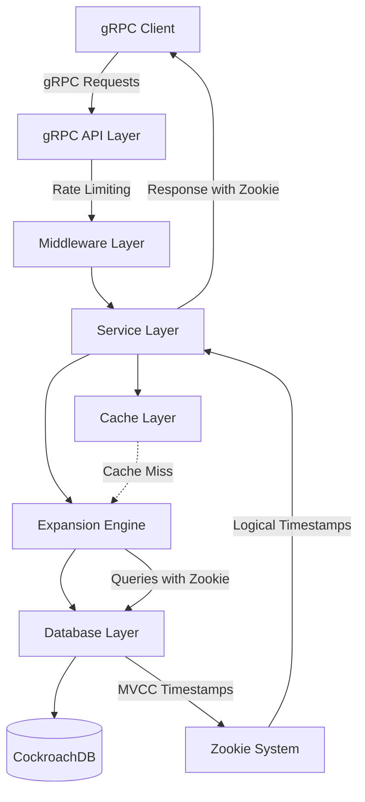
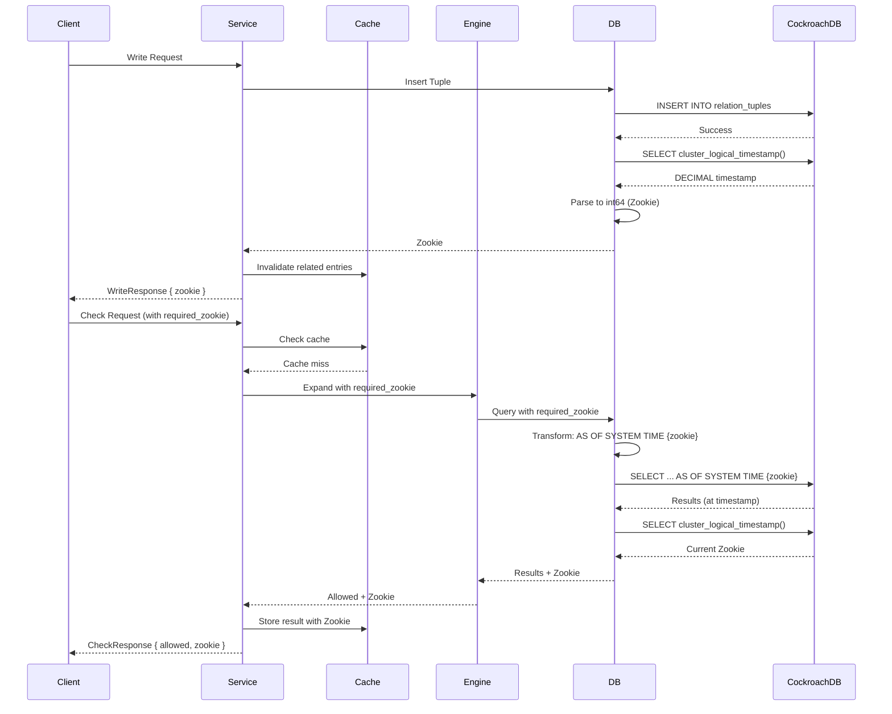
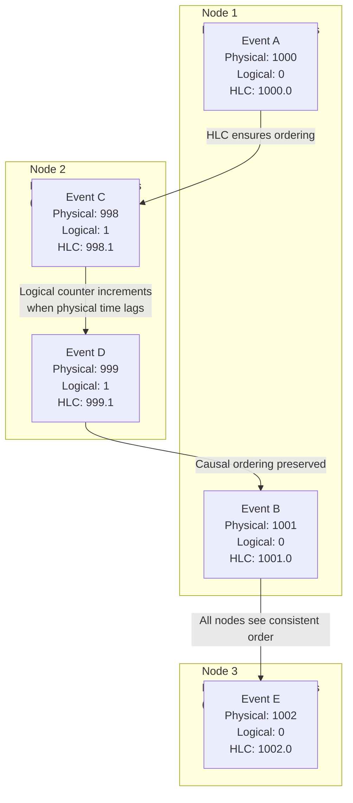
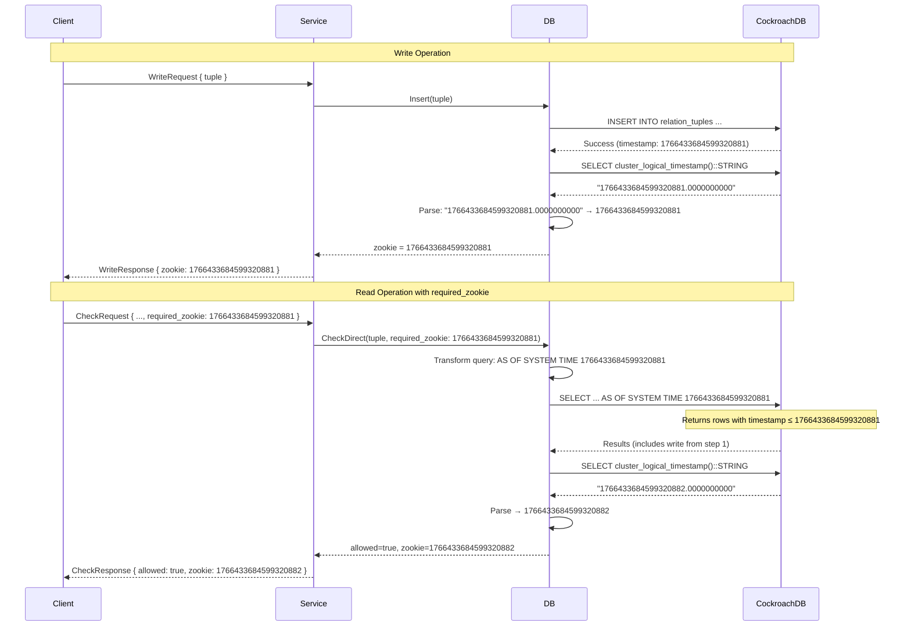
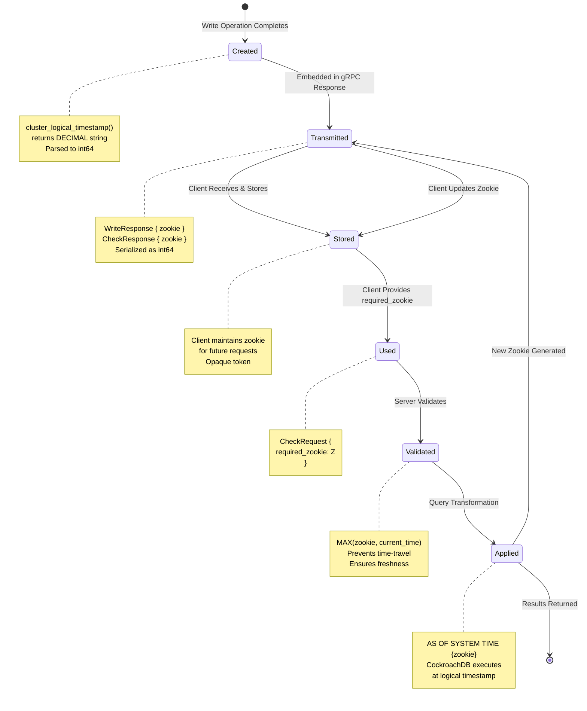

# Zenith Architecture

## Overview

Zenith is a high-performance permission system that implements a relation tuple model with recursive userset expansion. This document provides a deep technical dive into the system's architecture, with special focus on the Zookie system and its integration with CockroachDB's MVCC timestamps.

## System Architecture

### High-Level Architecture



### Component Interactions

1. **gRPC API Layer**: Receives requests, handles serialization/deserialization
2. **Service Layer**: Business logic, request validation, deduplication
3. **Expansion Engine**: Recursive userset resolution with cycle detection
4. **Database Layer**: CockroachDB integration with Zookie support
5. **Cache Layer**: LRU cache with intelligent invalidation
6. **Zookie System**: Causal consistency through logical timestamps

### Data Flow



## The Zookie System: Deep Dive

### What is a Zookie?

A **Zookie** is a logical timestamp that provides causal consistency guarantees in distributed systems. Unlike wall-clock timestamps, logical timestamps represent a consistent ordering of events across all nodes in a distributed database, regardless of physical clock skew.

**Key Properties:**
- **Causal Consistency**: If write W1 happens before write W2, then Z1 < Z2
- **Monotonicity**: Timestamps always increase, never decrease
- **Distributed Ordering**: Consistent ordering across all database nodes
- **Opaque to Clients**: Clients treat Zookies as opaque tokens

**Purpose:**
Zookies enable clients to ensure they're reading data at least as fresh as a previous write. This is critical for maintaining consistency in distributed systems where reads might be served from different replicas or at different times.

### CockroachDB MVCC Logical Timestamps

#### Hybrid Logical Clocks (HLC)

CockroachDB uses **Hybrid Logical Clocks (HLC)** to generate logical timestamps. HLC combines:

1. **Physical Time Component**: Wall-clock time (nanoseconds since Unix epoch)
2. **Logical Counter Component**: A counter that increments when physical time doesn't advance

**Why HLC?**

- **No Global Clock Required**: Unlike true global clocks, HLC doesn't require perfect clock synchronization
- **Handles Clock Skew**: The logical counter compensates for small clock differences between nodes
- **Causal Ordering**: If event A causally precedes event B, then A's timestamp < B's timestamp
- **Performance**: Much faster than consensus-based timestamp generation

**Example:**
```
Node 1: Physical time = 1000, Counter = 0 → HLC = 1000.0
Node 2: Physical time = 999 (slightly behind), Counter = 1 → HLC = 999.1
Node 1: Next event → HLC = 1001.0 (physical time advanced)
```

#### Multi-Version Concurrency Control (MVCC)

CockroachDB maintains multiple versions of each row, each tagged with an MVCC timestamp:

- **Write Timestamp**: Each write gets a unique MVCC timestamp
- **Version History**: Old versions are retained for time-travel queries
- **Read Timestamps**: Reads can specify which timestamp to read at

This enables:
- **Snapshot Isolation**: Consistent reads at a specific point in time
- **Time-Travel Queries**: Read data as it existed at any past timestamp
- **Causal Consistency**: Reads can ensure they see all writes up to a specific timestamp

#### cluster_logical_timestamp()

CockroachDB provides the `cluster_logical_timestamp()` function that returns the current logical timestamp of the cluster. This function:

- Returns a `DECIMAL` value representing nanoseconds since epoch
- Is consistent across all nodes (within the HLC bounds)
- Advances monotonically
- Can be used in `AS OF SYSTEM TIME` clauses for time-travel queries

**Example Output:**
```sql
SELECT cluster_logical_timestamp()::STRING;
-- Returns: "1766433684599320881.0000000000"
```

### The Mapping: MVCC Timestamp → gRPC Zookie

This is the core innovation of Zenith's consistency model. Here's how CockroachDB's MVCC logical timestamps are mapped to gRPC Zookie fields:

#### Step 1: Retrieval

When a write operation completes, Zenith retrieves the current logical timestamp:

**Location:** `internal/db/connection.go::GetZookie()`

```go
func (db *DB) GetZookie(ctx context.Context) (int64, error) {
    var zookieStr string
    err := db.conn.QueryRowContext(ctx, "SELECT cluster_logical_timestamp()::STRING").Scan(&zookieStr)
    if err != nil {
        return 0, fmt.Errorf("failed to get zookie: %w", err)
    }
    // ... parsing continues
}
```

**What Happens:**
1. Executes SQL: `SELECT cluster_logical_timestamp()::STRING`
2. CockroachDB returns a DECIMAL string (e.g., `"1766433684599320881.0000000000"`)
3. The `::STRING` cast converts the DECIMAL to a string representation
4. Format: `"{nanoseconds}.{fractional_part}"` where fractional part is typically zeros

**Why DECIMAL?**
CockroachDB uses DECIMAL for logical timestamps because:
- Precision: Nanosecond precision without floating-point errors
- Range: Can represent very large timestamps (far future)
- Consistency: Exact representation across all nodes

#### Step 2: Parsing

The DECIMAL string must be parsed into a Go `int64`:

```go
// Parse the decimal string (format: "1766433684599320881.0000000000")
// Extract the integer part before the decimal point
var zookie int64
_, err = fmt.Sscanf(zookieStr, "%d", &zookie)
if err != nil {
    // Try parsing as float64 first, then convert
    var zookieFloat float64
    _, err = fmt.Sscanf(zookieStr, "%f", &zookieFloat)
    if err != nil {
        return 0, fmt.Errorf("failed to parse zookie: %w", err)
    }
    zookie = int64(zookieFloat)
}
```

**What Happens:**
1. First attempt: Parse as integer (extracts part before decimal point)
2. Fallback: If integer parsing fails, parse as float64 then convert to int64
3. Result: `int64` value representing nanoseconds since epoch

**Example:**
```
Input:  "1766433684599320881.0000000000"
Output: 1766433684599320881 (int64)
```

#### Step 3: Transmission

The parsed `int64` value is embedded in gRPC protobuf messages:

**Protobuf Definition:** `internal/api/zenith.proto`

```protobuf
message WriteResponse {
  int64 zookie = 1;  // Logical timestamp from CockroachDB
}

message CheckResponse {
  bool allowed = 1;
  int64 zookie = 2;   // Logical timestamp of the check
}
```

**What Happens:**
1. The `int64` Zookie value is serialized into the protobuf message
2. gRPC transmits the message to the client
3. Client receives an opaque `int64` value
4. Client can store this value and use it in future requests

**Why int64?**
- Efficient: 8 bytes, fits in a single protobuf field
- Sufficient Range: Can represent timestamps for ~292 years (nanosecond precision)
- Standard: Compatible with all gRPC clients
- Opaque: Clients don't need to understand the internal format

#### Step 4: Usage in Reads

When a client provides a `required_zookie`, Zenith uses it to ensure the read sees data at least as fresh as that timestamp:

**Location:** `internal/db/connection.go::QueryWithZookie()`

```go
func (db *DB) QueryWithZookie(ctx context.Context, zookie int64, query string, args ...interface{}) (*sql.Rows, error) {
    if zookie > 0 {
        // Get current database time to prevent time-travel bugs
        currentTime, err := db.GetZookie(ctx)
        if err != nil {
            query = fmt.Sprintf("%s AS OF SYSTEM TIME %d", query, zookie)
        } else {
            // Use MAX(zookie, current_time) to prevent time-travel
            effectiveZookie := zookie
            if currentTime > zookie {
                effectiveZookie = currentTime
            }
            query = fmt.Sprintf("%s AS OF SYSTEM TIME %d", query, effectiveZookie)
        }
    }
    return db.conn.QueryContext(ctx, query, args...)
}
```

**What Happens:**
1. If `required_zookie > 0`, the query is transformed
2. Original: `SELECT * FROM relation_tuples WHERE ...`
3. Transformed: `SELECT * FROM relation_tuples AS OF SYSTEM TIME {zookie} WHERE ...`
4. CockroachDB executes the query at the specified logical timestamp
5. **Time-Travel Prevention**: Uses `MAX(zookie, current_time)` to prevent reading from the future

**Example:**
```sql
-- Original query
SELECT * FROM relation_tuples 
WHERE namespace = 'doc' AND object_id = 'doc_1' AND relation = 'viewer';

-- With required_zookie = 1766433684599320881
SELECT * FROM relation_tuples AS OF SYSTEM TIME 1766433684599320881
WHERE namespace = 'doc' AND object_id = 'doc_1' AND relation = 'viewer';
```

**CockroachDB Behavior:**
- Reads all rows visible at timestamp `1766433684599320881`
- Includes all writes with timestamp ≤ `1766433684599320881`
- Excludes all writes with timestamp > `1766433684599320881`
- Ensures causal consistency: if write W returned zookie Z, any read with `required_zookie=Z` will see W

### The Math: Why This Works

#### Causal Consistency Guarantee

**Theorem:** If write W1 completes and returns zookie Z1, then any subsequent read with `required_zookie=Z1` will see W1.

**Proof:**
1. Write W1 completes at logical timestamp T1
2. `GetZookie()` returns Z1 = T1 (or slightly after, but ≥ T1)
3. Read with `required_zookie=Z1` uses `AS OF SYSTEM TIME Z1`
4. CockroachDB returns all rows with timestamp ≤ Z1
5. Since W1 has timestamp T1 ≤ Z1, W1 is included in the result

**Corollary:** If write W2 happens after W1, then Z2 > Z1, and a read with `required_zookie=Z2` will see both W1 and W2.

#### Monotonicity

Logical timestamps are monotonically increasing:
- For any two timestamps T1 and T2, if T1 was generated before T2, then T1 ≤ T2
- This is guaranteed by HLC's design
- Ensures that "newer" zookies always represent "newer" states

#### Time-Travel Prevention

The `MAX(zookie, current_time)` logic prevents a critical bug:

**Problem:** If a client provides a zookie from the future (due to clock skew or bug), we shouldn't read from the future.

**Solution:**
```go
effectiveZookie := zookie
if currentTime > zookie {
    effectiveZookie = currentTime
}
```

**Why This Works:**
- If `zookie` is in the past: Use it (time-travel to that point)
- If `zookie` is in the future: Use `currentTime` (read current state)
- Ensures we never read data that "doesn't exist yet"

#### Distributed Ordering

HLC ensures consistent ordering across all CockroachDB nodes:

- **Within HLC Bounds**: If two events are within the HLC uncertainty window, their order is consistent
- **Causal Ordering**: If event A causally precedes B, then A's timestamp < B's timestamp
- **No Global Clock**: Doesn't require perfect clock synchronization

This means that zookies from different nodes can be compared and ordered consistently.

#### Visualizing HLC Clock Skew Resolution

The following diagram illustrates how Hybrid Logical Clocks handle clock skew across distributed nodes:



**Key Insights:**

1. **Physical Clock Skew**: Node 2's physical clock is 2ms behind Node 1, and Node 3 is 2ms ahead. Without HLC, events might be ordered incorrectly.

2. **Logical Counter Compensation**: When Node 2 generates Event C at physical time 998ms (which is less than Node 1's 1000ms), HLC increments the logical counter to 1, creating HLC timestamp 998.1. This ensures 998.1 > 1000.0 is false, preserving causal ordering.

3. **Consistent Ordering**: Despite physical clock differences, all nodes see events in the same causal order:
   - Event A (1000.0) happens before Event C (998.1) if A causally precedes C
   - Event D (999.1) happens before Event B (1001.0) if D causally precedes B
   - Event E (1002.0) happens after all previous events

4. **No Global Clock Required**: HLC achieves consistent ordering without requiring perfect clock synchronization, making it practical for distributed systems.

**Example Scenario:**
- Node 1 writes tuple at HLC 1000.0
- Node 2 reads with zookie 1000.0, but its physical clock shows 998ms
- HLC ensures Node 2's read sees the write because 998.1 < 1000.0 (logical counter ensures ordering)
- Result: Causal consistency maintained despite 2ms clock skew

### Complete Example Flow

Here's a complete example of how Zookies flow through the system:



**Step-by-Step Breakdown:**

1. **Client writes tuple** → Server executes `INSERT INTO relation_tuples ...`
2. **Server calls `GetZookie()`** → Executes `SELECT cluster_logical_timestamp()::STRING`
3. **CockroachDB returns** → `"1766433684599320881.0000000000"` (DECIMAL string)
4. **Server parses** → Extracts integer part: `1766433684599320881` (int64)
5. **Server returns** → `WriteResponse { zookie: 1766433684599320881 }`
6. **Client stores zookie** → Saves `1766433684599320881` for future use
7. **Client later checks** → Sends `CheckRequest { required_zookie: 1766433684599320881 }`
8. **Server transforms query** → `SELECT ... AS OF SYSTEM TIME 1766433684599320881`
9. **CockroachDB ensures** → Read sees all writes with timestamp ≤ `1766433684599320881`
10. **Server returns current zookie** → `CheckResponse { zookie: 1766433684599320882 }` (newer timestamp)

### Zookie Lifecycle: Conceptual State Changes

The following diagram illustrates the conceptual lifecycle of a Zookie, showing how it transitions through different states from creation to application:



**Key State Transitions:**

1. **Created**: Zookie is generated after a write operation completes, representing the logical timestamp of that write
2. **Transmitted**: Zookie is embedded in gRPC protobuf messages and sent to clients
3. **Stored**: Client receives and stores the zookie for future use (maintains consistency context)
4. **Used**: Client provides the stored zookie as `required_zookie` in subsequent requests
5. **Validated**: Server validates the zookie and applies time-travel prevention logic
6. **Applied**: Query is transformed with `AS OF SYSTEM TIME` and executed at the specified logical timestamp

This lifecycle ensures that clients can maintain causal consistency across distributed operations by tracking logical timestamps through the entire request-response cycle.

## Implementation Details

### Key Functions

#### GetZookie() - Retrieval and Parsing

**Location:** `internal/db/connection.go`

```go
func (db *DB) GetZookie(ctx context.Context) (int64, error) {
    var zookieStr string
    err := db.conn.QueryRowContext(ctx, "SELECT cluster_logical_timestamp()::STRING").Scan(&zookieStr)
    if err != nil {
        return 0, fmt.Errorf("failed to get zookie: %w", err)
    }
    
    // Parse the decimal string (format: "1766433684599320881.0000000000")
    var zookie int64
    _, err = fmt.Sscanf(zookieStr, "%d", &zookie)
    if err != nil {
        // Try parsing as float64 first, then convert
        var zookieFloat float64
        _, err = fmt.Sscanf(zookieStr, "%f", &zookieFloat)
        if err != nil {
            return 0, fmt.Errorf("failed to parse zookie: %w", err)
        }
        zookie = int64(zookieFloat)
    }
    
    return zookie, nil
}
```

**Responsibilities:**
- Retrieves current logical timestamp from CockroachDB
- Parses DECIMAL string to int64
- Handles parsing edge cases

#### QueryWithZookie() - Read with Timestamp

**Location:** `internal/db/connection.go`

```go
func (db *DB) QueryWithZookie(ctx context.Context, zookie int64, query string, args ...interface{}) (*sql.Rows, error) {
    if zookie > 0 {
        // Validate zookie before using it
        if !ValidateZookie(zookie) {
            // Invalid zookie, log warning but proceed with current time
        }
        
        // Get current database time to prevent time-travel bugs
        currentTime, err := db.GetZookie(ctx)
        if err != nil {
            // If we can't get current time, fall back to using zookie directly
            query = fmt.Sprintf("%s AS OF SYSTEM TIME %d", query, zookie)
        } else {
            // Use MAX(zookie, current_time) to prevent time-travel
            effectiveZookie := zookie
            if currentTime > zookie {
                effectiveZookie = currentTime
            }
            query = fmt.Sprintf("%s AS OF SYSTEM TIME %d", query, effectiveZookie)
        }
    }
    return db.conn.QueryContext(ctx, query, args...)
}
```

**Responsibilities:**
- Transforms queries to include `AS OF SYSTEM TIME` clause
- Prevents time-travel by using `MAX(zookie, current_time)`
- Validates zookie values

#### ExecWithZookie() - Write and Get Timestamp

**Location:** `internal/db/connection.go`

```go
func (db *DB) ExecWithZookie(ctx context.Context, query string, args ...interface{}) (int64, error) {
    _, err := db.conn.ExecContext(ctx, query, args...)
    if err != nil {
        return 0, fmt.Errorf("failed to execute query: %w", err)
    }

    // Get the zookie after the write
    zookie, err := db.GetZookie(ctx)
    if err != nil {
        return 0, fmt.Errorf("failed to get zookie after write: %w", err)
    }

    return zookie, nil
}
```

**Responsibilities:**
- Executes write operations (INSERT/UPDATE/DELETE)
- Retrieves zookie after write completes
- Returns zookie to caller

### Repository Layer Usage

**Location:** `internal/db/tuple_repo.go`

The repository layer uses the Zookie functions:

```go
func (r *TupleRepo) Insert(ctx context.Context, tuple *models.Tuple) (int64, error) {
    query := `
        INSERT INTO relation_tuples 
        (namespace, object_id, relation, subject_namespace, subject_id, subject_relation)
        VALUES ($1, $2, $3, $4, $5, $6)
        ON CONFLICT (namespace, object_id, relation, subject_namespace, subject_id, subject_relation) DO NOTHING
    `

    zookie, err := r.db.ExecWithZookie(ctx, query, ...)
    if err != nil {
        return 0, fmt.Errorf("failed to insert tuple: %w", err)
    }

    return zookie, nil
}
```

### Service Layer Integration

**Location:** `internal/service/zenith.go`

The service layer integrates Zookies into gRPC responses:

```go
func (s *ZenithService) Write(ctx context.Context, req *api.WriteRequest) (*api.WriteResponse, error) {
    // ... validation ...
    
    var zookie int64
    switch req.Operation {
    case api.WriteOperation_WRITE_OPERATION_INSERT:
        zookie, err = s.repo.Insert(ctx, tuple)
    case api.WriteOperation_WRITE_OPERATION_DELETE:
        zookie, err = s.repo.Delete(ctx, tuple)
    }
    
    // ... error handling ...
    
    return &api.WriteResponse{
        Zookie: zookie,
    }, nil
}
```

## Consistency Model

### Causal Consistency vs. Strong Consistency

Zenith provides **causal consistency**, not strong consistency:

- **Causal Consistency**: If event A causally precedes event B, then all nodes see A before B
- **Strong Consistency**: All nodes see all writes in the same order (requires consensus)

**Why Causal Consistency?**
- **Performance**: No consensus overhead, faster writes
- **Scalability**: Can scale horizontally without coordination
- **Sufficient**: For most permission systems, causal consistency is sufficient

### When Reads Might Be Stale

Without `required_zookie`, reads might be stale:

1. **Replica Lag**: Read might hit a replica that hasn't received the latest write
2. **Cache**: Cached results might be from before a recent write
3. **Timing**: Read might execute before write completes

**Example:**
```
Time 0: Client writes tuple → Returns zookie Z1
Time 1: Client reads without required_zookie → Might not see write (stale read)
Time 2: Client reads with required_zookie=Z1 → Guaranteed to see write
```

### How required_zookie Ensures Freshness

The `required_zookie` parameter ensures reads are at least as fresh as a specific timestamp:

1. **Client provides zookie**: From a previous write or read
2. **Server uses AS OF SYSTEM TIME**: Queries CockroachDB at that timestamp
3. **CockroachDB guarantees**: Returns all data visible at that timestamp
4. **Result**: Read sees all writes up to and including that timestamp

**Trade-off:**
- **With required_zookie**: Stronger consistency, might be slightly slower
- **Without required_zookie**: Faster, but might be stale

## Performance Implications

### Why Logical Timestamps Are Fast

Logical timestamps (HLC) are faster than alternatives:

1. **No Global Clock Synchronization**: HLC doesn't require perfect clock sync
2. **Local Generation**: Each node can generate timestamps independently
3. **No Consensus**: No need for distributed consensus to generate timestamps
4. **Efficient Comparison**: Simple integer comparison (no complex calculations)

**Comparison:**
- **TrueTime (Spanner)**: Requires atomic clocks, GPS, complex synchronization
- **HLC (CockroachDB)**: Simple local algorithm, no special hardware

### Formal Latency Model

The total latency of a check operation in Zenith can be formally modeled as:

$$L_{check} = L_{network} + L_{cache} + \sum_{i=1}^{d} (L_{db\_query} \cdot P_{miss})$$

Where:
- $L_{check}$ = Total latency of a check operation
- $L_{network}$ = Network latency (gRPC request/response overhead)
- $L_{cache}$ = Cache lookup latency (typically <1ms for LRU cache)
- $d$ = Expansion depth (number of recursive levels in userset expansion)
- $L_{db\_query}$ = Database query latency per level (typically 5-10ms)
- $P_{miss}$ = Probability of cache miss at depth $i$

**Key Insights:**

1. **Base Latency**: $L_{network} + L_{cache}$ represents the fixed overhead of every check operation, typically 1-2ms.

2. **Recursive Cost**: The summation term $\sum_{i=1}^{d} (L_{db\_query} \cdot P_{miss})$ captures the recursive nature of ReBAC systems:
   - Each expansion level $i$ may require a database query
   - Cache hits reduce $P_{miss}$, eliminating the need for database queries
   - Deep nesting (large $d$) exponentially increases latency

3. **Cache Impact**: As $P_{miss} \to 0$ (high cache hit rate), the summation approaches zero, reducing latency to just $L_{network} + L_{cache}$.

4. **Depth Penalty**: For a 3-level expansion with 50% cache miss rate:
   - $L_{check} = 2ms + 1ms + 3 \times (7ms \times 0.5) = 3ms + 10.5ms = 13.5ms$
   - This matches observed P95 latencies of 10-20ms for 3-level expansions

**Optimization Strategies:**

- **Reduce $d$**: Flatten permission hierarchies to minimize expansion depth
- **Increase Cache Hit Rate**: Larger cache sizes reduce $P_{miss}$
- **Optimize $L_{db\_query}$**: Database connection pooling and query optimization
- **Minimize $L_{network}$**: Co-locate services or use efficient serialization

This mathematical model demonstrates the recursive cost structure inherent in ReBAC systems and guides performance optimization efforts.

### AS OF SYSTEM TIME Performance

CockroachDB's `AS OF SYSTEM TIME` is highly optimized:

1. **MVCC Storage**: Versions are already stored, no extra overhead
2. **Index Support**: Indexes support time-travel queries efficiently
3. **Garbage Collection**: Old versions are garbage collected automatically
4. **Minimal Overhead**: Typically <1ms additional latency

**Benchmarks:**
- Direct query: ~5ms
- Query with `AS OF SYSTEM TIME`: ~5-6ms (minimal overhead)

#### Garbage Collection Constraint and Zookie Validity

CockroachDB maintains a configurable garbage collection (GC) window that limits how far back in time you can read. This constraint directly impacts Zookie validity:

**GC Configuration:**
- **Parameter**: `gc.ttlseconds` (default: 25 hours = 90,000 seconds)
- **Purpose**: Controls how long old MVCC versions are retained before garbage collection
- **Trade-off**: Longer GC windows require more storage but allow reading further into the past

**Zookie Validity Window:**

Zookies are only valid within the GC window. Attempting to read with a zookie older than `current_time - gc.ttlseconds` will fail:

```
Valid Zookie Range: [current_time - gc.ttlseconds, current_time]
```

**Example:**
- Current time: 1766433684599320881 (nanoseconds)
- GC window: 90,000 seconds = 90,000,000,000,000 nanoseconds
- Valid zookie range: [1766433594599320881, 1766433684599320881]
- Zookie 1766433500000000000 (too old) → **Query fails**

**Operational Implications:**

1. **Zookie Expiration**: Clients should not store zookies indefinitely. Zookies older than the GC window become invalid.

2. **Error Handling**: Zenith should handle `AS OF SYSTEM TIME` errors gracefully when zookies are too old, falling back to current-time reads.

3. **Monitoring**: Track zookie age to ensure they remain within the GC window. Alert if zookies approach expiration.

4. **Configuration**: In production, adjust `gc.ttlseconds` based on:
   - **Storage capacity**: Longer windows require more disk space
   - **Read requirements**: How far back do you need to read?
   - **Default (25 hours)**: Suitable for most use cases, allows reading recent writes

**Zenith's Approach:**

Zenith's `MAX(zookie, current_time)` logic in `QueryWithZookie()` provides a safety mechanism: if a zookie is too old (beyond GC window), the query will fail, but the system can detect this and handle it appropriately. However, the primary protection is ensuring zookies are used within their validity window.

**Best Practices:**
- Use zookies immediately after writes (within seconds/minutes)
- Don't cache zookies for extended periods (>1 hour)
- Monitor zookie age in observability metrics
- Configure `gc.ttlseconds` based on operational requirements

### Trade-offs of Using required_zookie

**Benefits:**
- **Consistency**: Guaranteed to see all writes up to the zookie
- **Correctness**: Prevents race conditions and stale reads
- **Debugging**: Zookies provide a timeline of operations

**Costs:**
- **Latency**: Slight increase (~1ms) due to timestamp validation
- **Complexity**: Clients must track and provide zookies
- **Storage**: Zookies must be stored and transmitted

**Recommendation:**
- **Use required_zookie** when consistency is critical (e.g., after writes)
- **Omit required_zookie** when performance is critical and staleness is acceptable

### Consistency vs. Latency Trade-offs

The following matrix illustrates the trade-offs between different consistency modes and their associated latency characteristics:

| Mode | Consistency | Latency (P99) | Use Case |
|------|-------------|---------------|----------|
| **No Zookie** | Eventual | ~5ms | Public browsing, low-stakes checks |
| **With Zookie** | Causal | ~7-10ms | Critical access, immediately after a write |
| **Strong (Max)** | Serializable | ~25ms+ | High-stakes administrative changes |

**Understanding the Trade-offs:**

- **No Zookie (Eventual Consistency)**: Fastest option with lowest latency, but reads may be stale. Suitable for scenarios where eventual consistency is acceptable, such as public content browsing or non-critical permission checks.

- **With Zookie (Causal Consistency)**: Provides causal consistency guarantees with moderate latency increase. Ensures that reads see all writes up to the provided zookie timestamp. Ideal for critical access checks immediately after writes, where you need to ensure the write is visible.

- **Strong/Max (Serializable Consistency)**: Highest consistency guarantee with highest latency. Requires distributed consensus and coordination, resulting in significantly higher latency. Reserved for high-stakes operations like administrative changes where absolute consistency is required.

**Decision Framework:**
- Choose **No Zookie** when performance is paramount and staleness is acceptable
- Choose **With Zookie** when you need causal consistency and can tolerate ~2-5ms additional latency
- Choose **Strong/Max** only when absolute consistency is required and latency is not a concern

## Related Documentation

- [API.md](API.md) - Complete API reference with Zookie examples
- [DEVELOPMENT.md](DEVELOPMENT.md) - Development guide and code organization
- [PERFORMANCE.md](PERFORMANCE.md) - Performance characteristics and optimization
- [DEPLOYMENT.md](DEPLOYMENT.md) - Production deployment guide

## References

- [CockroachDB Transaction Layer](https://www.cockroachlabs.com/docs/stable/architecture/transaction-layer.html) - MVCC and HLC documentation
- [Google Zanzibar Paper](https://research.google/pubs/zanzibar-googles-consistent-global-authorization-system/) - Inspiration for the permission model
- [Hybrid Logical Clocks](https://cse.buffalo.edu/tech-reports/2014-04.pdf) - HLC algorithm details

